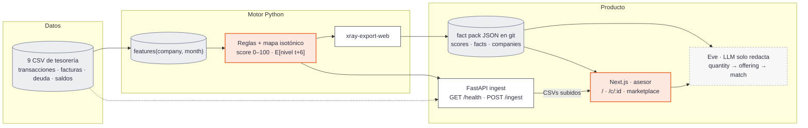

# X Ray — score de financiabilidad para pymes

Reto de **Embat** en **HackSpain 2026** (18–20 de septiembre, ETSIT UPM, Madrid).

> ¿Puede el dinero decir cómo está una empresa? Con 24 meses de rastro de tesorería (movimientos, facturas, deuda) de 1.286 empresas sintéticas, construimos un **score de financiabilidad a 6 meses** y, encima, un producto de **refinanciación / estructura de deuda** para el asesor de Embat.

## Qué hace

- **Score 0–100 mensual por empresa** = nivel de salud de tesorería esperado dentro de 6 meses, construido solo con datos de tesorería a partir de cuatro señales: días de caja, facturas de proveedores impagadas, cobertura de las cuotas y flujo neto de caja. Reglas calibradas, no una caja negra (`docs/rules_spec.md`).
- **Trayectoria, no foto:** presentado al estilo de las agencias de rating como **banda + outlook + trend + watch**, para distinguir un bache de un deterioro y detectar mejoras antes de que el banco las vea. El abanico a 6 meses son cuantiles reales del score por tramo de nivel y el watch sale de eventos extraídos de los CSV (`xray/events.py`: cliente principal perdido, vencimiento grande < 90 días, deuda nueva cara).
- **Explicable:** cada cambio del score se reparte exactamente entre las cuatro señales (`xray.explain`), y la narrativa la genera un LLM **solo** sobre esos datos estructurados. Versión sin tecnicismos en `docs/MODEL_toni.md` y `docs/sistema_en_cinco_figuras.html`.
- **Producto:** a quien tiene deuda, cuándo refinanciar y cuánto ahorra en €; a quien no, cuánto puede pedir y a qué cuota. Comprador: Embat (módulo pyme + comisión de originación al banco).

## Arquitectura



El Health Score lo calcula Python (`xray-score` / `xray-export-web`). FastAPI **no** sirve `GET /score`: solo puntúa CSVs subidos contra el `RulesModel` congelado. La ficha lee `web/lib/xray/dataset/` vía `GET /api/xray/score/{id}` (Next). Mapa del runtime: [`docs/auditoria_plataforma.md`](docs/auditoria_plataforma.md).

Dos *seams*: la tabla `features(company, month)` y el `ScoreSnapshot` Zod (`web/lib/xray/schemas.ts`), adaptado desde el export con `snapshotFromExported`. El uplift del marketplace es **otro** 0–100 en TypeScript (`scoring.ts`), no el mapa isotónico.

## Definición del score

```
SEÑALES_t  = cuatro medidas del mes, cada una como rango percentil entre las empresas de ese mes:
             días de caja · tasa de facturas de proveedores impagadas · cobertura de cuotas (6 m) · flujo neto de caja (3 m)
ÍNDICE_t   = media ponderada de los rangos (0,35 · 0,20 · 0,20 · 0,25); rojo = rango ≤ 0,20
NIVEL_t    = media móvil de 6 meses del índice
SCORE_t    = 0–100 = mapa monótono (isotónico, ajustado con el primer año) de NIVEL_t a E[NIVEL_{t+6}]
OUTLOOK_t  = persistencia: negativo si ≥ 3 meses rojos de 6 y el actual rojo; positivo si 3 verdes tras un rojo
TREND_t    = media de (índice − nivel) en 3 meses frente a ±0,10 → improving / flat / worsening
WATCH_t    = evento discreto a < 90 días (vencimiento grande, pérdida del cliente principal, deuda cara)
```

El evento de deterioro se define sobre el propio dataset (no hay etiqueta de impago): **≥ 2 de 4 señales en rojo durante ≥ 2 meses**. Un mes rojo son dos síntomas persistentes que coinciden, no un co-movimiento. Detalle y evidencia en [`docs/rules_spec.md`](docs/rules_spec.md), [`docs/plan.md`](docs/plan.md) §2 y [`docs/investigacion_score.md`](docs/investigacion_score.md).

## Evaluación

| Qué | Cómo |
|---|---|
| Acierto | AUC(h) para h = 1…12 en meses no vistos, contra el evento propio (0,71 a 6 m) **y** contra un resultado que el score no construye, el saldo bruto pasando a negativo (0,69 a 6 m, 0,72 a 1 m) |
| Anticipación | Persistencia: P(rojo a 6 m \| rojo hoy) 54 % frente a 12 % de base; lead time en tres cifras (crónicos 17 %, con cruce 7 % y mediana 3 meses, tardíos 50 %) |
| Direccionalidad | P(rojo a 6 m \| outlook negativo / estable / positivo) 66 / 8 / 16 % |
| Proyección | Cobertura del abanico 80 % = 82,8 % en test, MAE de la mediana 5,8 pts, pinball 1,845 frente a 1,853 de la base martingala; y resolución del watch: P(rojo en ≤ 3 m \| watch) 17,1 % frente a 7,8 % |
| Estabilidad | Matriz de transición mensual, % reversiones ≤ 3 m, PSI (pendiente, slice #5) |
| Generalización | Split temporal (train meses 1–12, test 13–18) y dispersión por grupos (`group_id`) |

Todo sale de `uv run xray-evals` (`artifacts/evals/metrics.json`), sobre la tabla real de `uv run xray-features`.

## Estructura del repositorio

```
xray/                         Paquete Python — el motor: data, features, profile, labels, rules, events, explain, evals, score
api/                          FastAPI de ingest: GET /health, POST /ingest (no hay GET /score)
web/                          Next.js + agente Eve; fact pack en lib/xray/dataset/; front del asesor
notebooks/                    Experimentos compartidos; importan xray, sin outputs en git
tests/                        pytest con fixtures mínimas (no necesita el dataset)
docs/auditoria_plataforma.md  Cómo está cableado hoy (runtime vs plan)
docs/rules_spec.md            Especificación viva del score por reglas; §11 las decisiones del 19 sep
docs/model_card.md            Ficha del modelo: qué significa el número, supuestos, cifras
docs/features_seam.md         Contrato de features(company_id, month) y decisiones del builder
docs/plan.md                  Decisiones de producto (el contrato API §6 es el diseño del viernes, no el runtime)
docs/tech_stack.md            PRD técnico: stack por capa, por qué, contratos, variables, riesgos
docs/MODEL_toni.md            El sistema explicado sin tecnicismos; docs/sistema_en_cinco_figuras.html
docs/investigacion_score.md   Evidencia (BIS, BdE, ECB, FinRegLab, agencias de rating)
docs/ideas_equipo.md          Brainstorming original y análisis por caso de uso
CONTEXTO_RETO.md              Enunciado del reto
input_data/                   Dataset (9 CSV + data_dictionary.md) — fuera de git; también docs/data/raw/
artifacts/                    Caché parquet, modelos, figuras — fuera de git
```

## Cómo arrancar

**Motor (Python, con [uv](https://docs.astral.sh/uv/)):**

```bash
uv sync --all-extras            # Python 3.12 + pandas, lightgbm, shap, fastapi, jupyterlab…
uv run xray-cache               # convierte los 9 CSV de input_data/ a parquet (30 s, una vez)
uv run xray-features            # tabla features(company_id, month) → artifacts/features.parquet (8 s)
uv run xray-evals               # métricas del score → artifacts/evals/metrics.json
uv run xray-score               # scores de todas las empresas → artifacts/scores/scores.parquet
uv run xray-export-web          # → web/lib/xray/dataset/scores.json (ficha + Eve)
uv run pytest                   # sin dataset (el humo sobre datos reales se salta si no hay caché)
uv run jupyter lab              # notebooks: from xray.data import load
```

Si el dataset está en otra carpeta: `export XRAY_DATA_DIR=/ruta/a/los/csv`. Tras la caché, `load("transactions")` tarda ~1 s en vez de ~30. Por defecto `xray.data` lee `docs/data/raw/` si existe `companies.csv`.

**Web (Next.js + agente Eve):**

```bash
cd web && npm install && npm run dev
```

En Vercel, *Root Directory* = `web`. `OPENAI_API_KEY` (Helmcode) y, para importar CSV, `XRAY_API_URL` apuntando a `uv run xray-api`. Blob: `BLOB_READ_WRITE_TOKEN`. Ver `web/AGENTS.md`.

**Notebooks desde otro repositorio:** `uv add "xray @ git+https://github.com/alvarovillalbaa/hackspain-2026"` y `XRAY_DATA_DIR` apuntando al dataset; reglas en [`notebooks/README.md`](notebooks/README.md).

Trabajo organizado en la [épica #13](https://github.com/alvarovillalbaa/hackspain-2026/issues/13) y sus 12 slices ([#1](https://github.com/alvarovillalbaa/hackspain-2026/issues/1)–[#12](https://github.com/alvarovillalbaa/hackspain-2026/issues/12)), cada uno con responsable, dependencias y criterio de aceptación.

## Datos

El dataset no está en el repositorio. Descárgalo del reto y colócalo en `input_data/`:

```
input_data/
├── groups.csv                 250 grupos empresariales
├── companies.csv              1.286 empresas (clave: company_id)
├── banking_products.csv       Cuentas bancarias
├── debt_products.csv          Préstamos, líneas, leasing, factoring, confirming, avales
├── debt_schedule_config.csv   Condiciones de 87 préstamos con cuadro de amortización
├── transactions.csv           2,5 M movimientos bancarios (sep-2024 → sep-2026)
├── invoices.csv               0,9 M facturas emitidas y recibidas (ERP)
├── balances.csv               Saldo final por producto a 2026-09-01
└── data_dictionary.md
```

Particularidades que hay que conocer antes de tocar los datos (detalle en [`docs/plan.md`](docs/plan.md) §5): no hay campo sector; las facturas no traen dirección (la codifica el signo del importe); en facturas `overdue` la `payment_date` no es real; los saldos históricos hay que reconstruirlos hacia atrás desde la foto final; solo 378 empresas tienen deuda.

## Equipo

Cinco personas: dos de ML, un full-stack, un UX/front (React) y un perfil de negocio. Reparto por día en [`docs/plan.md`](docs/plan.md) §7.

## Calendario

- **Sábado mañana:** sesión de Embat → validar curva de tipos y definición del evento.
- **Sábado 18:00:** revisión de semáforos; lo que esté en rojo pasa a plan B.
- **Domingo 10:00:** congelación de código; dos ensayos cronometrados por debajo de 5 minutos.
