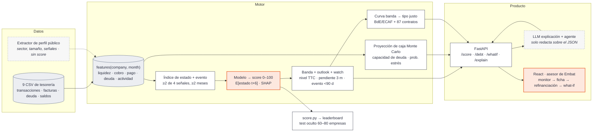

# X Ray — score de financiabilidad para pymes

Reto de **Embat** en **HackSpain 2026** (18–20 de septiembre, ETSIT UPM, Madrid).

> ¿Puede el dinero decir cómo está una empresa? Con 24 meses de rastro de tesorería (movimientos, facturas, deuda) de 1.286 empresas sintéticas, construimos un **score de financiabilidad a 6 meses** y, encima, un producto de **refinanciación / estructura de deuda** para el asesor de Embat.

## Qué hace

- **Score 0–100 mensual por empresa** = estado financiero esperado dentro de 6 meses, construido solo con datos de tesorería.
- **Trayectoria, no foto:** presentado al estilo de las agencias de rating como **banda + outlook + watch**, para distinguir un bache de un deterioro y detectar mejoras antes de que el banco las vea.
- **Explicable:** descomposición por cinco dimensiones (liquidez, cobro, pago, deuda, actividad) y narrativa generada por un LLM **solo** sobre datos estructurados.
- **Producto:** a quien tiene deuda, cuándo refinanciar y cuánto ahorra en €; a quien no, cuánto puede pedir y a qué cuota. Comprador: Embat (módulo pyme + comisión de originación al banco).

## Arquitectura



Dos *seams* fijan el trabajo en paralelo: la tabla `features(company, month)` (todo lo que hay debajo de la API la lee) y el contrato JSON de `GET /score/{company_id}` (front y back arrancan sobre stubs desde el primer día).

## Definición del score

```
NIVEL_t    = media móvil 6–12 m del índice de estado → banda de 7–9 grados anclada a PD realizada
             (cambia de banda solo si el deterioro persiste ≥ 3 meses)
OUTLOOK_t  = pendiente 3 m del score rápido + nº de alertas activas → positivo / estable / negativo
WATCH_t    = evento discreto a < 90 días (vencimiento grande, pérdida del cliente principal, deuda cara)
SCORE_t    = 0–100 = E[NIVEL_{t+6}]   ← lo que va al leaderboard
```

El evento de deterioro se define sobre el propio dataset (no hay etiqueta de impago): **≥ 2 de 4 señales en rojo durante ≥ 2 meses** — saldo mínimo reconstruido, facturas recibidas vencidas, cobertura del servicio de deuda, caída de entradas vs. mismo mes del año anterior. Detalle y evidencia en [`docs/plan.md`](docs/plan.md) §2 y [`docs/investigacion_score.md`](docs/investigacion_score.md).

## Evaluación

| Qué | Cómo |
|---|---|
| Acierto | AUC(h) / Gini(h) para h = 1…12 en hold-out; meta AUC(6) ≥ 0,70 |
| Anticipación | Lead time por evento: primer mes en que el score cruza umbral *y se mantiene*; objetivo mediana ≥ 3 meses |
| Direccionalidad | Spearman entre Δscore(t−3→t) y Δíndice(t→t+6); P(bajada \| outlook negativo) vs P(bajada \| estable) |
| Estabilidad | Matriz de transición mensual, % reversiones ≤ 3 m, PSI |
| Generalización | Split temporal (train meses 1–12, test 13–18) **y** GroupKFold por `group_id` |

## Estructura del repositorio

```
CONTEXTO_RETO.md              Enunciado del reto
docs/plan.md                  Decisiones cerradas: score, evento, componentes, API, reparto, pitch, plan B
docs/investigacion_score.md   Evidencia (BIS, BdE, ECB, FinRegLab, agencias de rating) — 111 referencias
docs/ideas_equipo.md          Brainstorming original y análisis por caso de uso
input_data/                   Dataset (9 CSV + data_dictionary.md) — fuera de git
```

Trabajo organizado en la [épica #13](https://github.com/alvarovillalbaa/hackspain-2026/issues/13) y sus 12 slices ([#1](https://github.com/alvarovillalbaa/hackspain-2026/issues/1)–[#12](https://github.com/alvarovillalbaa/hackspain-2026/issues/12)), cada uno con responsable, dependencias y criterio de aceptación.

## Datos

El dataset no está en el repositorio. Descárgalo del reto y colócalo en `input_data/`:

```
input_data/
├── groups.csv                 250 grupos empresariales
├── companies.csv              1.286 empresas (clave: company_id)
├── banking_products.csv       Cuentas bancarias
├── debt_products.csv          Préstamos, líneas, leasing, factoring, confirming, avales
├── debt_schedule_config.csv   Condiciones de 87 préstamos con cuadro de amortización
├── transactions.csv           2,5 M movimientos bancarios (sep-2024 → sep-2026)
├── invoices.csv               0,9 M facturas emitidas y recibidas (ERP)
├── balances.csv               Saldo final por producto a 2026-09-01
└── data_dictionary.md
```

Particularidades que hay que conocer antes de tocar los datos (detalle en [`docs/plan.md`](docs/plan.md) §5): no hay campo sector; las facturas no traen dirección (la codifica el signo del importe); en facturas `overdue` la `payment_date` no es real; los saldos históricos hay que reconstruirlos hacia atrás desde la foto final; solo 378 empresas tienen deuda.

## Equipo

Cinco personas: dos de ML, un full-stack, un UX/front (React) y un perfil de negocio. Reparto por día en [`docs/plan.md`](docs/plan.md) §7.

## Calendario

- **Sábado mañana:** sesión de Embat → validar curva de tipos y definición del evento.
- **Sábado 18:00:** revisión de semáforos; lo que esté en rojo pasa a plan B.
- **Domingo 10:00:** congelación de código; dos ensayos cronometrados por debajo de 5 minutos.
