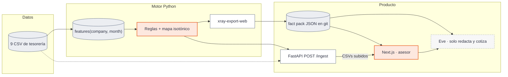

# X Ray — score de financiabilidad para pymes

Last updated: 2026-09-20

Reto de **Embat** en **HackSpain 2026** (18–20 de septiembre, ETSIT UPM, Madrid). Enunciado: [`CONTEXTO_RETO.md`](CONTEXTO_RETO.md).

> ¿Puede el dinero decir cómo está una empresa? Con 24 meses de tesorería de 1.286 pymes sintéticas construimos un **score de financiabilidad a 6 meses** y, encima, un **marketplace de refinanciación** para el asesor de Embat.

Índice de documentación: [`docs/knowledge/map.md`](docs/knowledge/map.md). Convenciones para agentes: [`AGENTS.md`](AGENTS.md).

## Descripción

X Ray lee el rastro de caja (movimientos, facturas, deuda) y responde, empresa a empresa y mes a mes, **hacia dónde va la tesorería**, no solo dónde está hoy.

| Capa | Qué es |
|---|---|
| **Health Score 0–100** | Esperanza calibrada del nivel de tesorería a 6 meses. Cuatro señales: días de caja, vencidas de proveedores, cobertura de cuotas, flujo neto. Reglas + mapa isotónico; no es una caja negra. |
| **Trayectoria** | Banda + outlook + trend + watch (estilo agencia de rating). Distingue un bache de un deterioro. El abanico a 6 meses son cuantiles reales del score; el watch sale de eventos en los CSV. |
| **Explicación** | Cada movimiento del score se reparte exactamente entre las cuatro señales (`xray.explain`). El LLM **solo redacta** sobre ese JSON. |
| **Producto** | A quien tiene deuda: cuándo refinanciar y cuánto ahorra en €. A quien no: cuánto puede pedir y a qué cuota. El asesor pide ofertas; Eve orquesta quantity → offering → match; el servidor **recalcula** match y uplift. |

El número, las bandas y las cifras de la ficha viven en [`docs/references/model-card.md`](docs/references/model-card.md) y [`docs/specs/rules-spec.md`](docs/specs/rules-spec.md). Versión sin tecnicismos: [`docs/knowledge/MODEL_toni.md`](docs/knowledge/MODEL_toni.md).

## Valor para la entidad financiera, y monetización

El comprador del software es **Embat** (ya tiene los datos). Quien gana con el número es la **entidad financiera** que origina: ve riesgo actualizado, no la foto anual de las cuentas.

| Para quién | Qué gana |
|---|---|
| **Banco / fintech que presta** | Lead pre-cualificado con trayectoria (banda, outlook, watch) en vez de un dossier estático. Match bilateral: apetito del emisor × capacidad del cliente. Recalcular el score *con la deuda nueva* antes de firmar. |
| **Asesor de Embat** | Una cola de empresas que se movieron este mes, una ficha que dice *por qué*, y un marketplace que cotiza sobre hechos — no un chat que inventa importes. |
| **Pyme (sujeto del score, no el comprador)** | Refinanciar cuando el tipo vivo es más caro que el que su banda justifica, o pedir **antes** de que el banco recorte la línea. |

**Modelo mixto (decisión de producto):**

1. **Módulo premium** dentro de Embat — el asesor ya está en la tesorería; X Ray es la capa de financiabilidad.
2. **Comisión de originación al banco** cuando se cierra una refinanciación o un préstamo nuevo. En la demo: **3 % del ticket** (`EMBAT_ORIGINATION_RATE` en `web/lib/xray/offer-metrics.ts`; el frame de Figma es 15 k€ sobre 500 k€). Esa tasa es una constante de producto, no una estimación del dataset.

Lo que el banco no tiene hoy: el rating interno llega con 6–12 meses de retraso. Aquí el estado de caja **persiste** (P(rojo a 6 m \| rojo hoy) 54 % frente a 12 % de base) y el watch avisa sin que nadie pregunte. Detalle comercial en [`docs/plans/2026-09-18-xray-hackathon.md`](docs/plans/2026-09-18-xray-hackathon.md) §1 y §8.

## Cómo usarlo

La demo es el **cockpit del asesor**. No es un notebook.

1. Arranca la web (`cd web && npm install && npm run dev`) — detalle en [Cómo reproducirlo](#cómo-reproducirlo).
2. Abre [`/start`](web/app/start/page.tsx) (consola de ensayo, noindex): fija el grupo foco (por defecto `GROUP_0147`) y entra a la ficha de grupo.
3. Recorre el flujo que se enseña al jurado:

| Ruta | Qué hace el asesor |
|---|---|
| `/` | Dashboard: KPIs, outlook, watch, top/bottom. |
| `/companies` | Cartera: score, estado, comparar, importar CSV. |
| `/c/:id` | Ficha: gauge, drivers, trayectoria, peers, acciones, ofertas. |
| `/c/:id/a/:actionId` | Marketplace: pipeline Eve + tabla de ofertas. Contratar → aprobar deal. |
| `/acciones` · `/productos` | Acciones de cartera y libro de deuda viva. |
| `/watchers` | Alertas del watcher (opcional: webhook Slack). |
| `/compare` | Hasta 3 empresas. |

Sin `OPENAI_API_KEY` / Gateway la ficha y el fact pack siguen vivos; Eve (chat, cotización, copy de acciones) falla cerrado — no inventa cifras. Packs de importación: [`data/packs/`](data/README.md). Runtime de sesión: [`web/data/runtime/README.md`](web/data/runtime/README.md).

Pantallas: [`docs/specs/frontend-v0.md`](docs/specs/frontend-v0.md).

## El reto — qué pedían y qué entregamos

Fuente: [enunciado Embat](https://claude.ai/artifact/8N8Q7QMjprCUWxGAiJaWoP?sk=5wYke4E8ukAw6afs6TrG1g) (copia en [`CONTEXTO_RETO.md`](CONTEXTO_RETO.md)). Embat confirmó el 19 sep que **no hay leaderboard ni script de scoring**; vale el producto encima del número. El resto del enunciado sigue vigente.

### Seis preguntas del sistema

| Pregunta del reto | Dónde está la respuesta |
|---|---|
| ¿Quién está sano? | Score 0–100 + banda. Reconoce la cola alta, no solo el deterioro. |
| ¿Quién está mejorando? | `trend` (improving / flat / worsening) y outlook positivo tras una racha roja. |
| ¿Quién empieza a torcerse? | Outlook negativo + watch (vencimiento &lt; 90 d, cliente principal perdido, deuda cara). |
| ¿Bache o caída? | Evento = ≥ 2 de 4 señales en rojo durante ≥ 2 meses. Un mes malo no basta. |
| ¿Por qué ha cambiado? | `drivers` exactos por señal; el LLM narra ese JSON. |
| ¿Cuándo se vio venir? | Lead time en tres cifras + persistencia a 6 m. Medido, no afirmado. |

### Requisitos de entrega

| Requisito | Estado | Cómo |
|---|---|---|
| Señal en las dos direcciones | Hecho | Outlook + trend; no es un detector de quiebras. |
| Trayectoria, no foto | Hecho | Nivel = media 6 m; score = E[nivel t+6]; abanico p10/p50/p90. |
| Explicación | Hecho | `xray.explain` + Eve Mode A. El LLM no calcula. |
| Producto encima del score | Hecho | Marketplace de refinanciación / estructura de deuda. |
| Comprador identificado | Hecho | Embat (módulo + comisión de originación). Usuario de demo: el asesor. |
| Demo navegable | Hecho | Next.js en `web/` (Vercel, *Root Directory* = `web`). |
| Predicción sobre test oculto / leaderboard | Sin efecto | Embat no lo opera. `xray-score --extra` sí puntúa empresas nuevas contra el perfil de referencia. |
| Anticipación medida (bonus) | Hecho | `uv run xray-evals` → `artifacts/evals/metrics.json`. |
| Monitor que avisa (bonus) | Hecho | Watcher + cola + Slack opcional. |

### Evaluación del jurado (tercios)

| Tercio | Qué mira el reto | Qué enseñamos |
|---|---|---|
| **Si acierta** | Generaliza, capta dirección, las dos caras | AUC(6) propia 0,71; AUC(6) *externa* (saldo bruto a negativo) 0,69; P(rojo t+6 \| outlook − / = / +) 66 / 8 / 16 %. |
| **Si llega a tiempo** | Meses de adelanto, bache vs deterioro, monitor | Persistencia 54 % vs 12 %; lead time crónicos 17 % / cruce 7 % (mediana 3 m) / tardíos 50 %; watch 15,2 % vs 7,8 %. |
| **Si vale algo** | Producto, comprador, explicación, artesanía | Marketplace + comisión; ficha navegable; drivers exactos. |

Cifras y supuestos: [`docs/references/model-card.md`](docs/references/model-card.md) §6. Se cuentan también las que salen mal: `trend = improving` casi no predice salir del rojo.

## Propuesta técnica



Tres decisiones que no se negocian:

| Decisión | Por qué |
|---|---|
| **El LLM nunca calcula** | Score y features en Python; uplift / match / banda del marketplace en TypeScript (`scoring.ts`, `match.ts`). Eve elige ids y textos; el servidor recomputa las cifras. |
| **Dos seams** | `features(company_id, month)` (Python) y `ScoreSnapshot` Zod (`web/lib/xray/schemas.ts`). Añadir columnas es libre; renombrar o cambiar el grano, no. |
| **Dos scores 0–100** | Health Score = mapa isotónico. Uplift del marketplace = otro 0–100 sobre dimensiones. No son el mismo número. |

FastAPI **no** sirve `GET /score`: solo `GET /health` y `POST /ingest` contra el `RulesModel` congelado. La ficha lee el fact pack vía `GET /api/xray/score/{id}` (Next).

Stack: [`docs/references/tech-stack.md`](docs/references/tech-stack.md). Runtime: [`docs/audits/2026-09-20-auditoria-plataforma.md`](docs/audits/2026-09-20-auditoria-plataforma.md).

## Mapa del repositorio

| Ruta | Qué | README |
|---|---|---|
| [`xray/`](xray/README.md) | Motor: data, features, rules, evals, score, explain, events | sí |
| [`api/`](api/README.md) | Ingest FastAPI | sí |
| [`web/`](web/README.md) | Next.js + Eve. Agentes: `web/AGENTS.md` | sí |
| [`web/lib/xray/`](web/lib/xray/README.md) | Seam TS: snapshot, match, store, marketplace | sí |
| [`web/agent/`](web/agent/README.md) | Agente Eve y subagentes | sí |
| [`data/`](data/README.md) | CSV del reto + packs demo | sí |
| [`tests/`](tests/README.md) | pytest (no junto al código) | sí |
| [`web/tests/`](web/tests/README.md) | vitest + Playwright | sí |
| [`web/evals/`](web/evals/README.md) | Calibración Eve / never-calculate | sí |
| [`notebooks/`](notebooks/README.md) | Experimentos; importan `xray` | sí |
| [`artifacts/`](artifacts/README.md) | Caché parquet / modelos (gitignored) | sí |
| [`docs/`](docs/knowledge/map.md) | Specs, runbooks, audits (AFS; nada suelto en la raíz) | mapa |
| [`company_optimization_pipeline/`](company_optimization_pipeline/README.md) | Screening stdlib (legado; no es el Health Score) | sí |
| [`src/xray_score/`](src/xray_score/README.md) | Spike histórico, sustituido por `xray/` | sí |

## Cómo reproducirlo

Comandos canónicos también en [`docs/runbooks/reproduccion.md`](docs/runbooks/reproduccion.md). El dataset **no está en git** (~645 MB): colócalo en `data/raw/` (o `export XRAY_DATA_DIR=…`). Inventario y trampas: [`data/README.md`](data/README.md).

### Cómo usarlo en local

```bash
# Python 3.12 (fijado en .python-version)
uv sync --all-extras
uv run xray-cache                 # CSV → parquet en artifacts/raw/ (una vez, ~30 s)

# Web (Node 24)
cd web && npm install && npm run dev
```

Copia `web/.env.example` → `web/.env.local`. Mínimo para Eve: `OPENAI_API_KEY` (Helmcode). Gateway: `AI_GATEWAY_API_KEY` o OIDC en Vercel. Ingest: `XRAY_API_URL=http://127.0.0.1:8000` y en otra terminal `uv run xray-api`. Blob (demo durable): `BLOB_READ_WRITE_TOKEN`. LLM: [`docs/runbooks/ai-runtime.md`](docs/runbooks/ai-runtime.md).

Sin dataset la web **sí** arranca: el fact pack (`web/lib/xray/dataset/*.json`) va en git.

### Cómo reproducir los resultados

Regenera scores, facts y métricas del método a partir de los CSV:

```bash
uv run xray-cache
uv run xray-features              # → artifacts/features.parquet
uv run xray-score                 # → artifacts/scores/scores.parquet + rules_model.json
uv run xray-evals                 # → artifacts/evals/metrics.json
uv run xray-export-web            # → web/lib/xray/dataset/scores.json (+ metrics.json)
cd web && npm run build:facts     # cash / deuda / facturas → facts.json
```

Lo que el jurado ve en la ficha (AUC, lead time, persistencia) sale de `metrics.json` del pack, no de un slide. Tablero HTML de resultados: `docs/results/dashboard_resultados.html`. Notebooks: [`notebooks/README.md`](notebooks/README.md).

Packs demo: `uv run xray-demopacks` → `data/packs/`.

### Cómo reproducir los tests

```bash
# Python — default: not legacy, not evals; cobertura fail_under 90
uv run pytest
uv run pytest --cov=xray --cov=api --cov-report=term-missing

# Web
cd web
npm run typecheck
npm test                          # vitest
npm run test:coverage
npm run test:e2e                  # Playwright (arranca Next)
npm run calibrate                 # Eve: CV / fidelidad ≤ 2 % (hace falta clave)
```

CI: [`.github/workflows/test.yml`](.github/workflows/test.yml) (pytest + typecheck + vitest coverage). Suites: [`tests/README.md`](tests/README.md), [`web/tests/README.md`](web/tests/README.md). Calibración: [`docs/runbooks/calibration.md`](docs/runbooks/calibration.md).

`npm run lint` arrastra errores de la plantilla (`components/ai-elements/`, …); no añadas nuevos en código nuestro.

## Pasos de desarrollo

Historia comprimida desde `git log` (18–20 sep 2026). Trabajo en la [épica #13](https://github.com/alvarovillalbaa/hackspain-2026/issues/13) y slices #1–#12, más el slice 14 de proyección/watch (#31).

| Cuándo | Qué se cerró |
|---|---|
| **18 sep — plantear** | Enunciado (`CONTEXTO_RETO.md`). Investigación del score (literatura + dataset). Primer spike de tesorería (`src/xray_score/`, luego descartado como motor). Plan de producto, ideas por caso de uso, PRD de stack, `AGENTS.md`. Monorepo: Next.js a `web/`, paquete instalable `xray`. Hallazgo clave del notebook 01: **no hay adelanto entre señales; sí persistencia** → el score pasa a ser pronóstico de persistencia por reglas, no un GBM. |
| **19 sep mañana — motor** | Contrato `features(company, month)` + builder real. Labels, reglas, mapa isotónico, outlook/trend/confidence. `xray-evals` (AUC propia y externa, lead time en tres cifras, GroupKFold). `xray-score` con ranking de empresas nuevas contra el perfil de referencia. Señales v2 (días de caja, tasa de vencidas de flujo, DSCR, flujo neto). Ficha del modelo. Embat confirma: no hay leaderboard. |
| **19 sep tarde — producto** | Front v0 sobre un único provider. Fact pack en git (la demo no espera a Python). Marketplace Eve: quantity → offering → match; el servidor recomputa. Acciones de ficha desde facts, no plantillas. Pipeline de screening por empresa/moneda (stdlib). Score de grupo, peers kNN, comparar 3, watcher → Slack. Simulador de caja + MPC (pista B) como motor de recomendación de tesorería; OPE (pista C) documentada, no en la demo. Chrome Embat, `/start`, modal de contratar. |
| **19 sep noche — anticipación** | Eventos de watch desde los CSV. Abanico `projection_6m` en el `RulesModel`. `metrics.json` al fact pack. Ingest CSV (`POST /ingest`) + packs demo. |
| **20 sep — demo** | Cockpit del asesor, ficha con banda/watch como titular, polish visual. QA: tests fuera del código, evals *never-calculate*, cobertura, runbooks de AI. |

## Historial de desarrollo

Cinco personas. Los recuentos son commits en `main` (autores agrupados; merges de Jorge cuentan aparte de sus PRs).

| Quién | Commits | Rol en el plan | Qué dejó en el repo |
|---|---|---|---|
| **Tianwei** | 87 | ML-2 | El Health Score: features, labels, rules, evals, explain, events, export, proyección/MPC, notebooks 01–05, model card y casi toda la spec. Luego el abanico, el watch desde CSV y el polish de la ficha (banda/watch, chrome). Es el autor del contrato analítico. |
| **Alvaro Villalba** | 24 | Full-stack / producto | El esqueleto Next+Eve, el seam `provider` / `ScoreSnapshot`, el marketplace orquestado, el fact pack en git, Blob/sesión, `/start`, el cockpit y la alineación de la UI al plan. Unifica Python y Vercel para que la demo no dependa de un portátil. |
| **Jorge García Martínez** | 22 | Full-stack (agente + cartera) | Tools de recuperación de Eve, acciones grounded, rollup de grupo, peers, comparar, cola de watch → Slack, pipeline de screening `company_optimization_pipeline/`, y el arreglo del stream hijo del marketplace. |
| **mikelgda** | 7 | ML-1 | Primer score explorable (el spike de tesorería), `.gitignore` del dump y de `artifacts/`, exploración + calibración Eve y viz. El motor de producción lo sustituyó el de reglas; el trabajo de dataset/carga queda debajo. |
| **tamudosoyyo11** | 2 | UX / front | Chrome Embat de grupos, compañías y fichas; ofertas de financiación y el modal de contratar préstamo — el frame que se enseña al jurado. |

Reparto previsto por día: [`docs/plans/2026-09-18-xray-hackathon.md`](docs/plans/2026-09-18-xray-hackathon.md) §7. Lo que el git enseña: ML-2 cargó el motor y la evidencia; el full-stack cerró el producto navegable; UX puso el chrome que se ve; ML-1 abrió el terreno el viernes.
