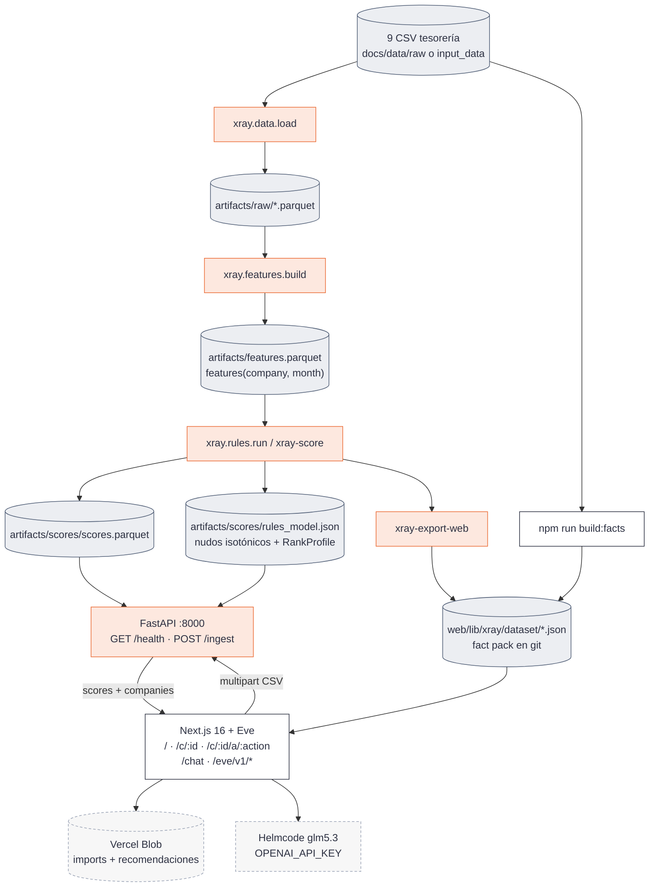

# Auditoría de la plataforma X Ray

**Date:** 2026-09-19
**Last updated:** 2026-09-19
**Author(s):** auditoría de código sobre `main` (árbol vivo, no el plan)
**Status:** Final
**Scope:** cómo funciona de punta a punta el producto que hay hoy: dataset → `xray/` → FastAPI de ingest → fact pack → Next.js + Eve. Incluye seams, contratos, agente, watcher, tests y deriva docs↔código.
**Fuera de alcance:** calidad estadística del score (eso vive en [`model_card.md`](model_card.md) y [`rules_spec.md`](rules_spec.md)); pitch comercial; revisión de seguridad ofensiva; el enunciado histórico del leaderboard (Embat confirmó que no aplica).
**Triggered by:** petición de un informe técnico de cómo funciona toda la plataforma.

---

## Executive Summary

X Ray es un **monolito modular de fin de semana**: un motor Python determinista que convierte 24 meses de tesorería en un score 0–100 de persistencia a 6 meses, y un producto Next.js para el asesor de Embat (cartera → ficha → marketplace de deuda → chat). El LLM **nunca calcula**: redacta y orquesta sobre JSON ya numerado.

La arquitectura real **no es** la del diagrama de [`README.md`](../README.md) ni la de [`plan.md`](plan.md) §6. FastAPI no sirve `/score`, `/debt`, `/whatif` ni `/explain`. El score de la demo sale de un **fact pack JSON committed** (`web/lib/xray/dataset/`) generado offline; FastAPI solo existe para **puntuar CSVs subidos** contra un `RulesModel` congelado. Las bandas AAA–C, el uplift del what-if y el match de productos viven en TypeScript, con **otra fórmula** que el Health Scorer de Python. La proyección `p10/p50/p90` es un stub determinista, no Monte Carlo.

El diseño anti-alucinación (tools + schemas Zod + `reassembleMatches` + fallback determinista + calibración Eve) está bien planteado. El riesgo de demo es **contrato trifásico** (plan §6 / export Python / `ScoreSnapshot` Zod) y **dos motores de score** en la misma ficha.

---

## Context

Reto Embat en HackSpain 2026 (18–20 sep): con el rastro de tesorería de ~1.286 empresas sintéticas (250 grupos, sep-2024 → sep-2026), construir un **score de salud financiera** y, encima, un **producto vendible**. Comprador: Embat. Usuario de la demo: el asesor (una cartera, sin auth, sin multi-tenant).

Decisiones de producto cerradas en [`plan.md`](plan.md). Este informe responde otra pregunta: **¿qué hay realmente cableado, quién es dueño de cada cifra, y qué se rompe si se toca un seam?**

---

## Methodology

Inspección del árbol vivo el 19 sep 2026: `xray/` (12 módulos), `api/main.py`, `web/app`, `web/lib/xray`, `web/agent`, `tests/`, `pyproject.toml`, `web/package.json`, y los docs de `docs/`. No se reentrenó el mapa isotónico ni se volvió a correr `xray-evals` para este informe; las cifras de AUC/lead time se citan de [`model_card.md`](model_card.md) (medidas sobre `artifacts/features.parquet`: 21.423 filas, 1.265 empresas).

Tools used: lectura de entrypoints, contratos (pydantic/zod), CLIs, rutas Next, tools Eve, tests de seam.
Code surface examined: `xray/`, `api/`, `web/`, `tests/`, `docs/`, más dos árboles huérfanos (`src/xray_score/`, `company_optimization_pipeline/`).

---

## 1. Producto en una frase

Un asesor de Embat abre una cartera de pymes, ve un **Health Score 0–100** con banda/outlook/trend/watch, entiende *qué señal lo movió*, y elige una acción de deuda (refinanciar, pedir, amortizar, línea, factoring, confirming). Eve explica en español y, si pide producto, orquesta quantity → offering → match. Un watcher dispara alertas si el outlook es negativo y el trend empeora, hay un evento discreto, o el DSCR cae bajo 1,2.

El número **no es PD de impago**. Es `E[nivel_{t+6}]` calibrado: la posición media, entre pares del mismo mes, que ocuparon en los seis meses siguientes las empresas que hoy están como esta. Detalle en [`model_card.md`](model_card.md) §1.

---

## 2. Arquitectura real

Tres runtimes, dos seams, cero Postgres para el score.



| Capa | Runtime | Dueño de la verdad | Qué no hace |
|---|---|---|---|
| `xray/` | Python 3.12, uv | Health Score, índice, evento, outlook/trend/watch/confidence, drivers exactos, evals | Bandas letra, Monte Carlo, curva de tipos, UI |
| `api/` | FastAPI + uvicorn | Ingest en vivo de CSVs contra el modelo de referencia | El contrato plan §6 (`GET /score`, `/debt`, `/whatif`, `/explain`) |
| `web/` | Next 16.3.5 + Eve 0.54.5 | Ficha, marketplace, chat, watcher, fact pack de caja/deuda/facturas | Recalcular el Health Score |
| Notebooks | Jupyter (extra uv) | Experimentos; importan `xray` | Fuente de verdad |

`xray/score.py` **no importa** `api/` ni Node. La API **sí** importa `xray`. El front **no** importa `xray` Python: consume JSON.

Hay un segundo pipeline analítico, **no** el score: `npm run build:facts` / `web/lib/xray/facts-builder.ts` deriva caja, contratos, aging e `implied_debt_rate` para acciones y tools de Eve. El Health Score sigue siendo solo Python (`uv run xray-export-web`).

---

## 3. Datos

### 3.1 Las nueve tablas

El dataset (~645 MB) no va en git. Resolución de ruta en `xray.data.data_dir()`:

1. argumento `data_dir`
2. `XRAY_DATA_DIR`
3. `<repo>/docs/data/raw` si existe `companies.csv`
4. `<repo>/input_data`

Caché parquet en `XRAY_ARTIFACTS_DIR` o `<repo>/artifacts/raw/`. `uv run xray-cache` convierte todo de una vez; `load("transactions")` pasa de ~30 s a ~1–2 s.

| Tabla | Rol en el motor |
|---|---|
| `groups` | 250 grupos; rollup de monitor (`explain.group_rollup`) |
| `companies` | 1.286 empresas; `company_id`, `group_id`, `country` (~18 % relleno), moneda |
| `banking_products` | Cuentas; el saldo del índice usa **solo corrientes** |
| `debt_products` | Préstamos, líneas, leasing, factoring, confirming, avales (378 empresas con deuda) |
| `debt_schedule_config` | 87 contratos / 40 empresas — **no** alimenta aún `xray/rates` (módulo inexistente) |
| `transactions` | ~2,5 M movimientos, 2024-09-01 → 2026-09-01 |
| `invoices` | ~0,9 M; **sin campo dirección** |
| `balances` | Foto final **única** a 2026-09-01 |

Constantes de ventana: `DATA_START = 2024-09-01`, `DATA_END = 2026-09-01`.

### 3.2 Quirks que el código ya aplica

En `xray.data._clean` (carga):

- `invoices.direction` = `issued` si `amount > 0`, `received` si `amount < 0`
- fechas de factura fuera de `[2000-01-01, 2030-12-31]` → NaT
- en `status == "overdue"`, se loguea el % en que `payment_date == due_date` (no es fecha de pago)
- `transactions.month` = periodo mensual
- `country`: `ESPAÑA`/`España` → `ES`

En `xray.features` (no en `data`):

- `invoice_rows()`: solo `document_type == "invoice"` y no `cancel`/`cancelled` (~15 % de recibidas no son facturas; ~2 % canceladas)
- reconstrucción de saldo **hacia atrás** desde la foto de `balances`
- la tabla de features **termina en 2026-08** (2026-09 tiene un solo día)
- 21 empresas sin cuenta corriente con saldo quedan **fuera** de la tabla (1.286 → 1.265)

Hechos que condicionan el modelo (detalle en [`plan.md`](plan.md) §5 y `AGENTS.md`):

- no hay sector; los pares son por tamaño y patrón de flujos
- `exchange_rate` vale 1,0 en el 90 % de movimientos no-EUR: **no convierte moneda**; las cuatro señales son ratios
- `interest_charge` no es el interés de los préstamos (mediana implícita ~0,3 % vs ~3 % en contratos)
- la reconstrucción de saldo **deriva**: % de cuentas en negativo cae ~10 % → ~2 % hacia la foto. Por eso etiqueta y modelo usan **rango percentil dentro del mes**, no euros
- las señales **no se anticipan** unas a otras (Spearman agrupado \|ρ\| ≤ 0,14); el estado **sí persiste**. El score es pronóstico de persistencia, no detector de adelanto

Nunca cargar CSV a pelo: siempre `xray.data.load()`.

---

## 4. Motor Python (`xray/`)

Paquete plano (sin subpaquetes). `__init__.py` lista módulos previstos que **no existen como fichero**: `model`, `bands`, `projection`, `rates`. LightGBM y SHAP están en `pyproject.toml` y **no se usan** en el camino de score.

### 4.1 Pipeline

```
CSV → data.load
    → features.build            # 8 s, 1.265 empresas
    → labels.rank_signals
    → labels.state_index
    → labels.events + label_t6
    → rules.level
    → rules.fit / RulesModel.predict
    → rules.outlook + trend + watch + confidence
    → explain.drivers_json (+ group_rollup)
    → score.py / evals / export_web
```

`rules.run()` encadena labels + level + fit-si-hace-falta + score. `xray-score` y `xray-export-web` llaman a eso; `POST /ingest` también, pero **con modelo ya cargado** y `rank_against=profile` (empresas nuevas contra la referencia, no entre ellas).

### 4.2 Seam 1 — `features(company_id, month)`

Contrato vivo: [`features_seam.md`](features_seam.md), código `xray/features.py`. **Añadir columnas es libre; renombrar o cambiar el grano no**, sin aviso al equipo.

Grano: una fila por empresa y mes natural (`YYYY-MM`), sin huecos dentro del rango activo (mes muerto = flujos 0 y saldo arrastrado). `months_of_history` empieza en 1. Lo que no existe es **NaN, nunca 0** (sin deuda → sin DSCR).

Cuatro señales del índice (`SIGNAL_COLUMNS`, v2 del 19 sep):

| Señal | Columna | Fórmula | Rojo si rango ≤ 0,20 |
|---|---|---|---|
| (i) liquidez | `cash_buffer_days` | `min_balance_eur / (outflows_eur / 30)` | cola baja |
| (ii) proveedores | `overdue_flow_rate_3m` | impagado de lo vencido en 3 m / vencido en 3 m | cola alta (ascending=False) |
| (iii) deuda | `dscr_6m` | entradas operativas 6 m / (`debt_repayment` + `interest_charge` 6 m) | cola baja |
| (iv) actividad | `net_cash_flow_ratio_3m` | (inflows − outflows) 3 m / outflows 3 m | cola baja |

Entradas operativas = categorías `collection`, `bulk_collection`, `pos_settlement`, `cash_settlement`. Cargos = todos los importes negativos, en positivo. `has_debt` se infiere de movimientos, no de `debt_products`.

**Reconstrucción de saldo (cuentas corrientes):** foto final en `balances` − cumsum inverso de netos diarios → EOD; `eom_balance_eur` = último EOD del mes; `min_balance_eur` = mínimo del mes, arrastrando el EOM previo a meses idle. Las líneas de crédito se reconstruyen aparte (`credit_line_usage` = dispuesto/concedido) y **no entran en el índice**; son driver de pantalla.

`derive()` calcula las dos primeras señales v2 sobre cualquier tabla que ya tenga las columnas base. `overdue_flow_rate()` es la implementación de referencia desde facturas: una recibida cuenta como vencida desde `due_date` y como impagada hasta el mes de `payment_date` **solo si** `status == "paid"`; si no, sigue impagada (el `payment_date` de overdue se ignora).

CLI: `uv run xray-features` → `artifacts/features.parquet`.

### 4.3 Labels — rangos, índice, evento, etiqueta

`xray/labels.py`. Nombres cortos estables (`balance`, `overdue`, `dscr`, `inflows`); cambian las columnas que leen, no las claves de pesos.

- `rank_signals`: percentil **dentro del mes**, empates por media, NaN fuera del rango. Orientado a 1 = más sana. Con `RankProfile`, se ranquea contra la población de referencia (camino de empresas nuevas / ingest).
- `state_index`: media ponderada de rangos disponibles; pesos renormalizados si falta una señal.

```
weights = balance 0.35 · inflows 0.25 · dscr 0.20 · overdue 0.20
red_cutoff = 0.20
min_signals = 1          # una basta; confidence avisa
```

NaN **nunca** es rojo. Mes rojo = `n_red ≥ 2`. Un mes rojo son dos síntomas persistentes que coinciden (co-ocurrencia 0,9–1,8× independencia), no un “co-movimiento” de literatura. La tasa de mes rojo sube con la cobertura (`n_signals`).

- **Evento de deterioro:** primer mes de ≥ 2 meses rojos seguidos. Un hueco de `< 2` verdes une episodios (`event_gap = 2`). Columnas `event` (arranca) e `in_event` (dentro).
- **Etiqueta `label_t6`:** media de `state_index` en t+1…t+6. NaN si falta algún mes futuro. Exige tabla sin huecos: “t+6” son seis filas, no seis meses de calendario.

### 4.4 Rules — nivel, mapa isotónico, capas de lectura

Todos los knobs en `RulesConfig` (`xray/rules.py`), valores acordados en [`rules_spec.md`](rules_spec.md).

| Campo | Cómo |
|---|---|
| `level` | media móvil 6 m de `state_index` (`min_periods=1`) |
| `score` | `np.interp(level, knots_x, knots_y)` ∈ [0, 100] |
| `outlook` | `negative` si ≥ 3 rojos en 6 m **y** t rojo; `positive` si últimos 3 verdes y ≥ 1 rojo en t−5…t−3; si no `stable` |
| `trend` | media de `(state_index − level)` en 3 m vs ±0,10 → `improving` / `flat` / `worsening`. **No toca el score** |
| `watch` | evento externo más reciente en 3 m; prioridad `large_maturity` > `main_customer_lost` > `expensive_new_debt` |
| `confidence` | `high` si historia ≥ 12 y ≥ 3 señales; `medium` si ≥ 6 y ≥ 2; si no `low` |

**Calibración del mapa.** `sklearn.isotonic.IsotonicRegression(y_min=0, y_max=1, out_of_bounds="clip")` de `level` → `label_t6` sobre `month ≤ 2025-08` (7.777 filas, 135 nudos). `knots_y` se guarda ×100. El orden de empresas por score **es** el orden por nivel: lo aprendido solo cambia la escala. Hoy el mapa comprime ~18,6–68,7 (un nivel de rangos a 6 m revierte al centro; por encima de 0,75 es plano). Las bandas letra **estiran para pantalla** en TypeScript; el número no.

`RulesModel` persiste JSON compacto: nudos, `train_until`, `lead_cutoff` (P20 de scores de train, hoy 39,8), `n_train`, y el `rank_profile` (~100 k valores, todos los meses, no solo train). `predict` interpola y recorta en los extremos.

Identidad útil: `level_window == horizon == 6`, así el nivel en t+6 **es** la etiqueta de t, y el score a 6 meses es el mapa aplicado a `label_t6` (test en `tests/test_rules.py`). Cambiar una ventana sin la otra rompe la lectura “E[nivel a t+6]”.

**Watch desde CSV aún no se extrae.** `watch()` espera una tabla `events_ext(company_id, month, kind)`. Sin ella, `watch` es null en el motor. El watcher de Eve lee el campo que llegue en el snapshot (y el DSCR).

### 4.5 RankProfile — empresas nuevas

`xray/profile.py`. Por mes y señal, guarda los valores de referencia ordenados. Una empresa nueva se inserta en esa población: su puntuación **no depende** de con quién venga en el lote. Una copia de una empresa de referencia obtiene exactamente su score (`tests/test_score.py`, `tests/test_profile.py`). Mes futuro sin referencia → mes más cercano.

### 4.6 Explain — drivers exactos, no SHAP

`xray/explain.py`. Con pesos fijos y nivel = media de rangos:

```
Δlevel_s = w_s × (MA(rank_s, t) − MA(rank_s, t−3))
Δpoints  = Δlevel_s × (Δscore / Δlevel)     # pendiente local del mapa
```

La suma de `delta` coincide con el cambio de score cuando las cuatro señales están en las dos ventanas; si falta alguna, la renormalización deja residuo. `signal` en el JSON es el **nombre de columna** (`cash_buffer_days`, …), no el corto. `since` = primer mes de la racha roja actual. `export_web` filtra `|delta| ≥ 0,5` y recorta a 6 para la ficha; `driver_detail` guarda la lista completa.

`group_rollup(group_id, month)`: score ponderado por `operating_inflows_eur` (suelo 1 €), `score_min`, filial más débil, `share_negative`. No es tesorería consolidada. `xray-score` lo escribe en `artifacts/scores/groups.parquet` en la pasada completa (no con `--extra`).

### 4.7 Batch score y export al fact pack

```bash
uv run xray-score --features artifacts/features.parquet
# → artifacts/scores/scores.parquet + rules_model.json + groups.parquet

uv run xray-score --features ref.parquet --extra nuevas.parquet --model artifacts/scores/rules_model.json
# solo las extra, ranqueadas contra el perfil del modelo

uv run xray-export-web
# → web/lib/xray/dataset/scores.json  (una fila por empresa = último mes con score)
```

`records_from_scored` es el **seam compartido** CLI ↔ ingest API. Mapea dimensiones para el radar TS:

```
liquidity   ← rank_balance
collections ← rank_overdue
debt        ← rank_dscr
activity    ← rank_inflows
payments    ← 0.4·rank_overdue + 0.6·rank_inflows
```

`origin` se escribe `"ml"` aunque el motor sea reglas + isotónica (resto de LightGBM).

**Proyección 6 m (stub, slice #6 no aterrizó):**

```
delta  = score_t − score_{t-min(3,n)}
spread = max(4, |delta|·1.5 + 4)
p10    = clip(score + 0.5·delta − spread)
p50    = clip(score + delta)
p90    = clip(score + 1.2·delta + 0.6·spread)
```

Se presenta en la ficha como intervalos. No hay covarianza, ni shock de tipos, ni Monte Carlo.

### 4.8 Evals

`uv run xray-evals` → `artifacts/evals/metrics.json`. Split temporal: train ≤ 2025-08, test 2025-09…2026-02. Cifras de la tabla real ([`model_card.md`](model_card.md) §6):

| Métrica | Valor | Lectura honesta |
|---|---|---|
| AUC(6) evento propio | 0,715 | El evento sale de los mismos rangos → mide persistencia |
| AUC(6) externa (saldo min. bruto < 0) | 0,685 (h=1: 0,718) | Resultado que el score **no** construye; la cifra del título |
| Lead time (379 eventos) | crónicos 17 % · cruce ≥ 2 m 7 % (mediana 3 m) · tardíos 50 % · 1.er mes 26 % | Anticipación que este dataset tiene |
| P(rojo t+6 \| rojo t) | 54 % vs 11,7 % base | Horizonte con lift ≥ 2×: 12 m |
| P(rojo t+6 \| outlook neg/est/pos) | 66 / 8 / 16 % | Outlook afirma persistencia |
| Trend improving vs rojo t+6 | 8 % (flat 12 %, worsening 12 %) | La mejora casi no se predice |
| Fiabilidad del mapa | desvío medio 0,9 pts/decil | El decil más sano se queda corto (tope plano 67,1) |
| Dispersión GroupKFold | 0,69 ± 0,05 | Variabilidad entre grupos, no generalización (mapa monótono) |

GBM retador: **no hay trainer**. `evals` admite `--name gbm` como hueco.

### 4.9 Unify — CSVs del asesor → tablas canónicas

`xray/unify.py`. El wizard mapea columnas fuente → canónicas, concatena por tema, aplica la misma limpieza que `data._clean`, y resume cobertura. Tablas mínimas para puntuar: `companies`, `banking_products`, `transactions`, `balances`. Una empresa sin saldo de corriente se marca `scorable=False`.

`xray-testsets` genera slices de QA en `docs/data/raw/qa/` (single_company, split_files, multi_company, minimal, bad, group). Packs de **demo** para el wizard: `uv run xray-demopacks` → `docs/data/raw/new/` (`group` = GROUP_0147, `update` = COMP_0001 con mes 2026-09 estresado). El catálogo de marketplace es `web/lib/xray/dataset/product_catalog.json` (no se importa por CSV).

---

## 5. FastAPI (`api/main.py`)

Título OpenAPI: **“X Ray ingest”**. Arranque: `uv run xray-api` (puerto `PORT` o 8000). Al lifespan carga:

- `XRAY_RULES_MODEL` o `artifacts/scores/rules_model.json`
- `XRAY_REF_SCORES` o `artifacts/scores/scores.parquet` → `peer_ref` (percentiles de la referencia)

| Método | Path | Qué hace |
|---|---|---|
| `GET` | `/health` | modelo cargado, path, nº empresas y meses de referencia |
| `POST` | `/ingest` | multipart CSVs + `mappings` JSON → `unify` → `features.build` → `rules.run(..., rank_against=profile)` → `records_from_scored(peer_ref=…)` |

Form fields extra: `target_company_id` / `target_group_id` / `target_country` / `target_currency` para update-in-place (todas las filas remapeadas a esa empresa). Nombres de display sintéticos (FNV-ish sobre `company_id`: «Iberia Distribución 412»).

**No hay** `XRAY_STUB`, ni los cinco endpoints de [`plan.md`](plan.md) §6, ni pydantic del `ScoreSnapshot`. El GET `/score/{id}` de la demo es **Next.js** leyendo el fact pack.

El front llama a esto solo desde `POST /api/xray/import`, con tope **4,5 MB** (límite de body de Vercel). Packs recomendados: `docs/data/raw/new/group` (3 empresas del mismo grupo) o `docs/data/raw/new/update` (recalcular COMP_0001).

---

## 6. Producto web (`web/`)

Plantilla `ai-app-jumpstart` + demo X Ray. Un `withEve(nextConfig)` monta el agente en `/eve/v1/*`. Un `npm run dev` y un deploy Vercel (Root Directory = `web`) sirven front y agente. `web/vercel.json` **omite el build** si el commit no toca `web/` (para que PRs de Python no tumben Vercel).

### 6.1 Rutas de usuario

| Ruta | Pantalla |
|---|---|
| `/` | Portfolio por `group_id`, búsqueda, diálogo Importar |
| `/c/[companyId]` | Ficha: gauge, banda, outlook, trend, watch/alerts, sub-scores, proyección 6 m, radar, trayectoria, drivers, acciones con uplift |
| `/c/[companyId]/a/[actionId]` | `kind === "amortize"` → dashboard de amortización; si no, marketplace (ranking, `?p=` detalle/negociación) |
| `/chat` | Chat Eve |
| `/s`, `/s/[sessionId]` | Chat sin sesión / reanudar sesión Eve |

Sin auth de producto. Canal Eve: OIDC Vercel + `localDev` + `placeholderAuth`. Watch dispatch: Bearer `WATCH_DISPATCH_SECRET`.

### 6.2 Seam UI — `provider`

Única asignación viva (`web/lib/xray/provider.ts`):

```ts
export const provider: XrayProvider = eveProvider;
```

Pantallas y `components/xray/**` **no** importan `lib/xray/registry/`. `eveProvider` solo hace HTTP a `/api/xray/*`, así el fact pack **no entra en el bundle del browser**. No hay mock de cartera. Cableado de pantallas: [`frontend_v0.md`](frontend_v0.md).

Hooks: `hooks/xray/use-companies`, `use-company-score`, `use-actions`, `use-product-matches`, `use-csv-preview`, `use-column-mapping`, `use-amortize-context`, `use-selection`. IDs importados también en `localStorage` (`xray.imported.v0`).

### 6.3 API routes Next (el “backend” que sí existe)

| Método | Path | Rol |
|---|---|---|
| `GET` | `/api/xray/companies` | Fact pack + imports Blob |
| `GET` | `/api/xray/score/[companyId]` | `ScoreSnapshot` (import gana sobre pack) |
| `GET` | `/api/xray/actions/[companyId]` | Acciones ground + copy Eve |
| `GET` | `/api/xray/facts/[companyId]` | Contexto amortize |
| `POST` | `/api/xray/recommend` | Marketplace (timeout Eve 45 s, `maxDuration` 60) |
| `GET` | `/api/xray/recommend/stream` | SSE de fases (skeleton UX) |
| `POST` | `/api/xray/import` | Proxy a `XRAY_API_URL/ingest` + Blob + watcher |

`snapshotFromExported` (`lib/xray/snapshot.ts`) es el adaptador **export Python → ficha**:

- `band` **no viene** en `scores.json`; se deriva con `scoreToBand(score)`
- `sub_scores.bankability` = 100·(0,40 liq + 0,35 debt + 0,25 payments)
- `sub_scores.business_profile` = 100·(0,45 collections + 0,55 activity)
- `alerts`: watch (warning) + `dscr_6m < 1.2` (critical)
- `explanation`: siempre `null` en este camino (no hay `/explain`)

### 6.4 Bandas (TypeScript, no Python)

`web/lib/xray/bands.ts`. PD indicativa anclada a mano, no a PD realizada del dataset:

| Banda | minScore | PD indicativa |
|---|---|---|
| AAA | 92 | 0,2 % |
| AA | 84 | 0,5 % |
| A | 76 | 1 % |
| BBB | 68 | 2 % |
| BB | 55 | 5 % |
| B | 42 | 10 % |
| CCC | 28 | 20 % |
| CC | 14 | 35 % |
| C | 0 | 50 % |

Como el Health Score real se comprime ~19–69, **casi nadie sale AAA/AA/A**: la masa cae en BB/B/BBB. Las bandas “estiran” una escala que el mapa no recorre.

### 6.5 Segundo motor de score (what-if / uplift)

`web/lib/xray/scoring.ts` **recompone** un 0–100 desde el vector de dimensiones:

```
score = 100 · (0.28·liq + 0.18·col + 0.18·pay + 0.26·debt + 0.10·act)
```

`applyAction` escala `dimension_deltas` por `amount / recommended_amount` (tope 1,5×), clampea dims a [0,1], y vuelve a `scoreFromDimensions`. **La misma función** alimenta uplift de tarjeta de acción y de producto. `radarProjection` compara contra `scoreFromDimensions(dims)`, **no** contra el Health Scorer isotónico.

Consecuencia: el número grande de la ficha y el “+3,2 al refinanciar” **no salen del mismo modelo**. Es el hallazgo de arquitectura más caro de explicar al jurado si alguien pregunta.

Deltas de acción los elige `recommendActions` (`lib/xray/recommend-actions.ts`) con reglas sobre facts (caja ociosa vs deuda, contratos > 4,5 %, línea, factoring/confirming, DSCR). El LLM **no** elige importes. Top 4 por `weight`. `applyAgentCopy` solo pinta título.

### 6.6 Match bilateral

`web/lib/xray/match.ts`. Suelo DSCR 1,2. `clientFit` = 0,30 cobertura + 0,30 tipo vs implícito + 0,20 plazo vs ciclo de caja + 0,20 holgura DSCR. `issuerAppetite` por banda y ticket. Score final = **media armónica** (un 0 mata el deal). `defaultFitContext` estima tipo implícito, ciclo y inflow mensual **desde dimensiones**, no desde el cuadro de amortización (otro proxy).

`reassembleMatches` tira las cifras de match/uplift/banda del motor TS; del LLM solo usa ids, ranking order, textos, términos e `ideal_amount` (y si el POST trae `amount`, **pisa** el del agente).

### 6.7 Resolución de `POST /api/xray/recommend`

Orden en código:

1. cache in-memory del proceso
2. snapshot vivo (import > pack)
3. si no es import fresco y no hay `amount`: Blob `xray/recommendations/{company:action}.json`
4. warm `dataset/recommendations.json` (git)
5. sesión Eve, `RecommendationDecisionSchema`, 45 s
6. `deterministicMarketplace` si falta clave, timeout o Zod

La calibración Eve **no** pasa por esta ruta: el warm cache haría pasar el gate midiendo bytes. Usa `eve eval` → sesión nueva (`docs/calibration.md`).

---

## 7. Agente Eve

| Pieza | Path |
|---|---|
| Entry | `web/agent/agent.ts` → `defineAgent({ ...agentRuntime() })` |
| Modelo | `web/agent/lib/model.ts`: Helmcode `glm5.3` @ `https://api.helmcode.com/v1`, solo `OPENAI_API_KEY`, contexto 128 k |
| Identidad | `web/agent/instructions.md` — modos Analista / Orquestador / Watcher; **“You never calculate”** |
| Tools analista | `get_company_overview`, `get_working_capital_series`, `get_opportunities`, `get_peer_percentiles`, `get_recommended_actions`, `get_refinancing_rate_benchmark`, `get_group_netting` |
| Subagentes marketplace | `quantity` → `offering` → `match` |
| Subagente watcher | `evaluate_watch` (gate TS) + `submit_alerts` |
| Self-mod | plantilla Eve; no es el producto |

Tools y `agent/lib/data.ts` leen el **mismo** fact pack committed. `data.ts` reconstruye filas “estilo pipeline CSV” (idle cash, implied rate, overdue…) **sin** depender de `company_optimization_pipeline/outputs/` (gitignored). Varios campos (`fee_outflow`, `loc_*`, `debt_repayment_outflow`) salen a `"0"` en ese reshape: Eve puede citar un cero que no es “observado cero”, es “no cableado”.

Guardias anti-cifra inventada, en capas:

1. instrucciones non-negotiable
2. tools solo leen JSON existente
3. `compute_match` / `solve_amount` deterministas en subagentes
4. schema de decisión **sin** match % ni uplift finales
5. `reassembleMatches` / `applyAgentCopy` en servidor
6. fallback determinista
7. calibración: CV ≤ 2 %, error relativo ≤ 2 %, grounding ≥ 98 %; categóricos → unanimidad a N=8

Mode A documenta un shape “pipeline” (`level`, `state_index`, `rank_*`) distinto del `ScoreSnapshot` de la ficha. El modelo tiene que “trabajar con lo que llegue”; es una fuente de deriva.

---

## 8. Watcher

Bonus del enunciado: monitor con alertas autónomas. Spec: [`watcher_agent.md`](watcher_agent.md).

Gate puro `evaluateWatch(snapshot, { dscr_6m })` en `web/agent/lib/watch-rules.ts`:

| `rule_id` | Condición | Severidad |
|---|---|---|
| `dscr_floor` | `dscr_6m < 1.2` | critical |
| `outlook_negative_worsening` | outlook negative **y** trend worsening | warning |
| `watch_event` | `watch != null` | warning |

El LLM no decide deterioro; redacta sobre `evidence` que ya está en el JSON. Dedupe `(company_id, rule_id, month)`. Barrido cron: laborables 07:00 UTC, máx. 8 empresas (`schedules/portfolio-watch.ts`). Fan-out `POST /internal/watch` con `WATCH_DISPATCH_SECRET`. Canales Slack y Resend: si falta env, se omite ese canal. Post-import: `lib/xray/watch-on-import.ts`.

Sin interpolar `projection_6m` (el stub no merece alerta).

---

## 9. Persistencia

| Store | Qué | Condición |
|---|---|---|
| Git | `companies.json`, `facts.json`, `scores.json`, `recommendations.json` | build Vercel |
| Vercel Blob | `xray/imports/{id}.json`, `xray/recommendations/{company:action}.json` | `BLOB_READ_WRITE_TOKEN` |
| Memoria de proceso | fallback imports + caches recommend/actions | local / preview sin token |
| `localStorage` | lista de companies importadas | cliente |
| Alert log | in-memory + Blob opcional | watcher |

**Supabase** está en `package.json` (`@supabase/ssr`, `@supabase/supabase-js`) y en [`tech_stack.md`](tech_stack.md) §5.3 (sesiones, watchlist, explanations). **Cero uso** en código de producto: no hay `createClient`, no hay `web/supabase/`. Dependencia muerta de la plantilla.

No hay Postgres para el score. No hay autenticación de asesor.

---

## 10. Los dos seams — y el tercero que creció

Los dos seams anunciados en `AGENTS.md`:

1. **`features(company_id, month)`** — dentro de Python. Lo leen `labels`, `rules`, `explain`, `evals`, `score`. Tests al seam (`tests/fixtures/features_mock.csv`: `MOCK_DIP`, `MOCK_DETERIORATION`, `MOCK_SHORT`), no al parseo interno.
2. **JSON `GET /score/{id}`** — pensado como pydantic + zod + stubs en el mismo commit. En la práctica el GET vive en Next, el export Python trae campos extra (`level`, `state_index`, `ranks`, `signals`, `driver_detail`) y **no** trae `band` / `sub_scores` / `alerts`. Zod (`ScoreSnapshotSchema`) es el contrato de **ficha**, no el del export.

Tercer seam de facto:

3. **`records_from_scored` ↔ `snapshotFromExported` ↔ `ScoreSnapshot`** — tres formas del mismo objeto. Cambiar un campo exige tocar Python export, tipos `ExportedScore`, el mapper, Zod y a menudo `instructions.md`.

`driver` en plan §6 no lleva `value`/`rank`; el export sí en `driver_detail`; la ficha se queda con `{signal, delta, since}`.

---

## 11. Inventario de capacidades (usuario)

Cada ítem es invocable hoy, salvo nota.

- Ver cartera agrupada por grupo, buscar, abrir ficha
- Ver Health Score 0–100, banda letra, outlook, trend, watch, confidence, percentil entre pares
- Ver trayectoria hasta 24 m, drivers de los últimos 3 m, radar de 5 dimensiones, proyección stub p10/p50/p90
- Ver sub-scores bancabilidad / perfil de negocio (fórmula TS, no Python)
- Elegir hasta 4 acciones con importe y uplift deterministas
- Marketplace: ranking de productos, negociación de palancas, what-if de importe
- Dashboard de amortizar con caja ociosa
- Importar CSV (wizard de mapping) y puntuar contra la referencia (requiere `XRAY_API_URL` y modelo)
- Chat analista Eve sobre una empresa (tools de overview, series, oportunidades, peers, netting de grupo)
- Pedir recomendación de producto (orquestación o fallback)
- Vigilar empresa / cron de portfolio (Slack/email si hay env)
- Regenerar fact pack (`build:facts` + `xray-export-web`) y calentar recomendaciones (`warm:recommendations`)
- Evaluar el score (`xray-evals`) y la fidelidad del agente (`npm run calibrate`)

No hay: what-if Monte Carlo, curva BdE/ECAF → tipo justo, GBM+SHAP, perfil público web (slice #1) metido en features, multi-asesor, auth, leaderboard Embat.

---

## 12. Tests, calidad, deploy

**Python** (`uv run pytest`, `testpaths = tests`): seams con fixture de 3 empresas, sin dataset. Humo opcional sobre caché real. `test_calibration_determinism.py` exige byte-igualdad de `score_table` (el score no tiene RNG). `src/xray_score/tests` y `company_optimization_pipeline/tests` **no** entran en `testpaths`.

**Web** (`cd web && npm test`): vitest sobre lógica pura de `lib/xray`, algunos hooks, `agent/lib`, evals de calibración. `npm run typecheck` debe seguir limpio. `npm run lint` arrastra 18 `react-hooks/set-state-in-effect` de la plantilla; no añadir ninguno en código nuestro.

**Calibración Eve:** `docs/calibration.md`, `web/evals/calibration/`, manifiesto `COMP_0001` / `COMP_0047` / `COMP_0203`. ~48 sesiones a N=8; tag `slow`. El doc aún menciona `AI_GATEWAY_API_KEY`; el runtime usa `OPENAI_API_KEY` + Helmcode.

**CI:** no hay workflows en `.github/workflows/` en este árbol. Deploy: Vercel sobre `web/`; Python de ingest se asume local + túnel (`XRAY_API_URL`), decisión 19 sep en [`tech_stack.md`](tech_stack.md) §5.2. Node `24.x`.

**Árboles huérfanos (no son el motor):**

| Ruta | Qué es |
|---|---|
| `src/xray_score/` | Spike histórico “treasury-resilience”; README dice superseded by `xray/`. `main.py` raíz aún puede importarlo |
| `company_optimization_pipeline/` | Pipeline stdlib de oportunidades / WC / netting; Eve ya no lee sus `outputs/`; facts-builder + `agent/lib/data.ts` lo sustituyen |

---

## Findings

### Finding 1: El contrato `/score` existe en tres formas incompatibles

**Severity:** High
**Category:** Architecture

**Evidence:** [`plan.md`](plan.md) §6 muestra `band: "BB"`, `sub_scores`, `explanation`, endpoints FastAPI. `xray/export_web.py` emite `level`/`state_index`/`ranks`/`signals`/`origin: "ml"` y **no** emite `band`. `ScoreSnapshotSchema` exige `band` enum AAA…C y `alerts`. `snapshotFromExported` sintetiza la diferencia.

**Impact:** Un cambio “de un campo” no cabe en un commit coordinado como pide `AGENTS.md`. Eve Mode A y la ficha no ven el mismo objeto. El pitch habla de FastAPI `/score` y la demo no lo tiene.

**Detail:** El seam operativo de producto es Zod + mapper, no el ejemplo del viernes. Hasta que plan §6, pydantic (inexistente) y export coincidan, cada capa inventa defaults (`outlook` → `stable`, `trend` inválido → `flat`, `peer` → 50).

---

### Finding 2: Dos motores de score en la misma ficha

**Severity:** High
**Category:** Architecture

**Evidence:** Health Scorer = isotónica sobre nivel de rangos (`xray/rules.py`). Uplift / radar / after-action = `scoreFromDimensions` con pesos 0,28/0,18/0,18/0,26/0,10 (`web/lib/xray/scoring.ts`). Dimensiones del export = ranks, no el score 0–100. `radarProjection` compara contra el recompuesto, no contra el isotónico.

**Impact:** “Este préstamo te sube 4 puntos” no es un movimiento del Health Score. Si el jurado cruza el gauge con el what-if, salen números distintos para el mismo estado. El LLM tiene orden de no recalcular el score… y el servidor sí recalcula **otro**.

**Detail:** Fue el atajo correcto para no bloquear el marketplace el sábado (slice #6 Monte Carlo no aterrizó). Sigue siendo el atajo.

---

### Finding 3: FastAPI no implementa el contrato de producto

**Severity:** Medium
**Category:** Architecture

**Evidence:** `api/main.py` documenta dos rutas. README todavía dice «slice #8, pendiente». [`tech_stack.md`](tech_stack.md) lista cinco endpoints y flag `XRAY_STUB`.

**Impact:** La web de Vercel no puede puntuar el fact pack vía Python; depende de JSON en git. El ingest **sí** está vivo y es el único camino de empresas nuevas. Sin túnel / `XRAY_API_URL`, el wizard de import falla.

---

### Finding 4: `projection_6m` se lee como simulación y es un stub

**Severity:** Medium
**Category:** Reliability

**Evidence:** docstring en `export_web._projection_6m`: *“Deterministic approximation until Monte Carlo (slice #6) lands.”* No hay `xray/projection.py`. El watcher acierta al no alertar sobre esos p10/p90. La ficha los pinta como intervalo.

**Impact:** Un asesor puede anclar una decisión a un abanico que solo refleja el delta reciente del score ± un spread ad hoc. [`model_card.md`](model_card.md) §4 nota que la proyección honesta serían cuantiles de la etiqueta condicional al nivel (identidad `level_window == horizon`), y tampoco está cableada.

---

### Finding 5: Bandas letra y PD anclada no salen del motor ni del dataset

**Severity:** Medium
**Category:** Architecture

**Evidence:** `web/lib/xray/bands.ts` umbrales 92/84/76/… y PD 0,002…0,50. Mapa isotónico recorre ~19–69 ([`model_card.md`](model_card.md) §4). Slice #5 (`xray/bands.py`) no existe. `model_card` §7: *«Bandas aún no existen»*.

**Impact:** La metáfora “como las agencias de rating” está en UI, no en calibración. AAA es casi inalcanzable con el número real. [`revision_objetivo_score.md`](revision_objetivo_score.md) propone anclar bandas a PD de rotura de caja; no está hecho.

---

### Finding 6: Documentación operativa desfasada

**Severity:** Medium
**Category:** Other

**Evidence:** README, `frontend_v0.md`, `AGENTS.md` (mapa `api/`, seam de ficha) y `web/AGENTS.md` se alinearon al runtime el 19 sep. Sigue el desfase en:

- `docs/plan.md` §6 y `docs/tech_stack.md` §6.2: FastAPI `/score · /debt · /whatif · /explain` (diseño del viernes)
- `xray/__init__.py`: módulos `model`/`bands`/`projection`/`rates` como previstos
- `AGENTS.md`: `xray/rates` para coste de deuda (módulo inexistente)
- `docs/calibration.md`: `AI_GATEWAY_API_KEY` vs `OPENAI_API_KEY` + Helmcode
- `tech_stack.md`: Supabase “sesiones del asesor”; deps instaladas, 0 call sites
- `origin: "ml"` en export
- `web/agent/instructions.md`: cita `GET /score/{company_id}` FastAPI

**Impact:** Un agente o un compañero que lea el README construye el sistema equivocado. Este informe existe sobre todo por eso.

---

### Finding 7: Código muerto / paralelo al lado del motor

**Severity:** Low
**Category:** Code Quality

**Evidence:** `src/xray_score/` (README: superseded), `company_optimization_pipeline/` (Eve ya no lee `outputs/`), LightGBM+SHAP sin trainer, Supabase sin cliente, `main.py` raíz importando `xray_score`.

**Impact:** Pytest del paquete no los cubre; un `grep` despista. El pipeline stdlib aún documenta fórmulas de oportunidades que `facts-builder` reimplementa en TS: dos definiciones de `implied_debt_rate` / idle cash.

---

### Finding 8: Watch de producto y watch del motor no están conectados a los CSV

**Severity:** Low
**Category:** Reliability

**Evidence:** `rules.watch` exige `events_ext`; nadie la construye desde vencimientos / cliente principal / deuda cara. El watcher de Eve sí reacciona al campo `watch` **si llega**, más outlook+trend y DSCR. Concentración de clientes y `top_customer_share_12m` están en features y no disparan `main_customer_lost`.

**Impact:** La capa “watch por vencimiento en 4 meses” del pitch casi siempre sale vacía, salvo datos de fixture/eventos a mano.

---

### Finding 9: Ingest en Vercel está a un tope de 4,5 MB y a un proceso Python ajeno

**Severity:** Medium
**Category:** Reliability

**Evidence:** `app/api/xray/import/route.ts` rechaza > 4,5 MB. FastAPI no está en el mismo deploy. Sin `rules_model.json` local, `/health` ni siquiera arranca (`FileNotFoundError`).

**Impact:** Demo de import = slice pequeño + portátil/túnel encendido. El fact pack de 1.265 empresas no pasa por ahí; está precomputado.

---

### Finding 10: Tools Eve rellenan ceros donde el pipeline antiguo tenía series

**Severity:** Low
**Category:** Other

**Evidence:** `web/agent/lib/data.ts` pone `fee_outflow`, `loc_granted`/`drawn`/`undrawn`, `debt_repayment_outflow` a `"0"` y `interest_charge_outflow` a un proxy `annualInterest/4`. `instructions.md` manda citar `fee_outflow` como hallazgo.

**Impact:** El analista puede narrar “comisiones 0” o “línea no dispuesta” por un reshape, no por tesorería. Las instrucciones piden respetar `caveat`; no todas las tools lo emiten.

---

## Recommendations

| # | Recommendation | Finding | Effort | Priority |
|---|---|---|---|---|
| 1 | Elegir **un** contrato de ficha (Zod `ScoreSnapshot`) y hacer que `records_from_scored` lo emita, o documentar el mapper como único adaptador y actualizar plan §6 | 1, 6 | M | High |
| 2 | En la ficha, etiquetar el uplift como “impacto en el índice de dimensiones (what-if)”, no como Δ del Health Score — o reaplicar el mapa isotónico tras simular ranks | 2 | S / L | High |
| 3 | Pintar `projection_6m` como “tendencia reciente ± banda”, o sustituir por cuantiles de etiqueta \| nivel ([`model_card.md`](model_card.md) §4) | 4 | S–M | High |
| 4 | Anotar en `plan.md` §6 / `tech_stack.md` §6.2 que el contrato FastAPI es diseño del viernes (runtime = ingest + fact pack); alinear `__init__.py`. Este informe ya está en `AGENTS.md` «Cuándo leer qué» | 6 | S | High |
| 5 | Extraer `events_ext` desde features (cliente recurrente ≥ 20 % que desaparece; vencimiento grande; deuda nueva cara) o quitar watch del pitch | 8 | M | Medium |
| 6 | Recalibrar umbrales de banda al rango real 19–69, o anclar a PD de rotura de caja | 5 | M | Medium |
| 7 | Borrar o archivar `src/xray_score/` y dejar de importarlo en `main.py`; marcar el pipeline stdlib como legado | 7 | S | Medium |
| 8 | Quitar deps Supabase o cablear el P1 de persistencia de watchlist | 6, 7 | S / M | Low |
| 9 | No emitir `fee_outflow: "0"`; omitir el campo si no hay dato (NaN de features, no cero) | 10 | S | Medium |
| 10 | Un Dockerfile de 10 líneas para `xray-api` (Render/Fly) si la demo de import no puede depender de un portátil | 3, 9 | M | Medium |

**Effort guide:** S = &lt; 1 día, M = 1–5 días, L = &gt; 5 días. En horario de hackathon, 1+2+4 caben antes de congelar código; 5 y 6 no.

---

## Mapa: dónde está la verdad

| Pregunta | Documento / código |
|---|---|
| Qué construimos y por qué | [`plan.md`](plan.md) |
| Cómo se calcula el score, parámetros | [`rules_spec.md`](rules_spec.md), `xray/rules.py`, `xray/labels.py` |
| Qué asume el número, cifras de eval | [`model_card.md`](model_card.md) |
| Contrato de la tabla mensual | [`features_seam.md`](features_seam.md), `xray/features.py` |
| Stack, env, riesgos de deploy | [`tech_stack.md`](tech_stack.md) |
| Sin tecnicismos | [`MODEL_toni.md`](MODEL_toni.md), [`sistema_en_cinco_figuras.html`](sistema_en_cinco_figuras.html) |
| Evidencia literatura | [`investigacion_score.md`](investigacion_score.md) |
| Front (parcialmente obsoleto) | [`frontend_v0.md`](frontend_v0.md) — preferir `web/AGENTS.md` + este informe |
| Eve / calibración | `web/AGENTS.md`, [`calibration.md`](calibration.md), `web/agent/instructions.md` |
| Watcher | [`watcher_agent.md`](watcher_agent.md) |
| Enunciado | [`../CONTEXTO_RETO.md`](../CONTEXTO_RETO.md) |
| **Cómo está cableado hoy** | **este fichero** |

---

## Appendix

### A. CLIs

```bash
uv sync --all-extras
uv run xray-cache              # CSV → artifacts/raw/*.parquet
uv run xray-features           # → artifacts/features.parquet
uv run xray-score              # → artifacts/scores/{scores,groups,rules_model}
uv run xray-evals              # → artifacts/evals/metrics.json
uv run xray-export-web         # → web/lib/xray/dataset/scores.json
uv run xray-testsets           # slices de QA → docs/data/raw/qa/
uv run xray-demopacks          # packs demo → docs/data/raw/new/
uv run xray-api                # FastAPI ingest :8000
uv run pytest

cd web
npm install
npm run build:facts            # companies.json + facts.json (no el score)
npm run warm:recommendations   # recommendations.json
npm run dev                    # Next + Eve
npm run typecheck && npm test
npm run calibrate              # fidelidad Eve (caro)
```

### B. Variables de entorno

| Variable | Dónde | Efecto |
|---|---|---|
| `XRAY_DATA_DIR` | Python | Carpeta de CSV |
| `XRAY_ARTIFACTS_DIR` | Python | Caché / modelos |
| `XRAY_RULES_MODEL` | API | JSON del mapa |
| `XRAY_REF_SCORES` | API | parquet de referencia para peers |
| `PORT` | API | default 8000 |
| `XRAY_API_URL` | web | ingest; default `http://127.0.0.1:8000` |
| `OPENAI_API_KEY` | web/Eve | Helmcode |
| `BLOB_READ_WRITE_TOKEN` | web | persistencia durable |
| `WATCH_DISPATCH_SECRET` | web | cron → `/internal/watch` |
| `SLACK_*` / `RESEND_*` / `ALERT_EMAIL_*` | watcher | canales |
| `NEXT_PUBLIC_SUPABASE_*` | documentadas, **no usadas** | — |

### C. Fórmula compacta del Health Score

```
rank_s,t     = percentil_mes(señal_s)           # 1 = más sana
red_s,t      = 1[rank_s,t ≤ 0.20]
índice_t     = Σ w_s rank_s / Σ w_s             # w = (0.35, 0.25, 0.20, 0.20)
mes_rojo     = 1[Σ red ≥ 2]
nivel_t      = MA_6(índice)
score_t      = 100 · isotónica_train(nivel_t)   # train ≤ 2025-08
evento       = primer mes de 2 rojos seguidos (hueco < 2 verdes = mismo episodio)
```

### D. Related resources

- Épica y slices: GitHub `alvarovillalbaa/hackspain-2026` issues #13 y #1–#12
- Spec viva del 19 sep: [`rules_spec.md`](rules_spec.md) §11
- Identidad `level_window == horizon`: `tests/test_rules.py`
- Anti-alucinación numérica: `web/lib/xray/reassemble.ts`, `web/lib/xray/deterministic-marketplace.ts`
