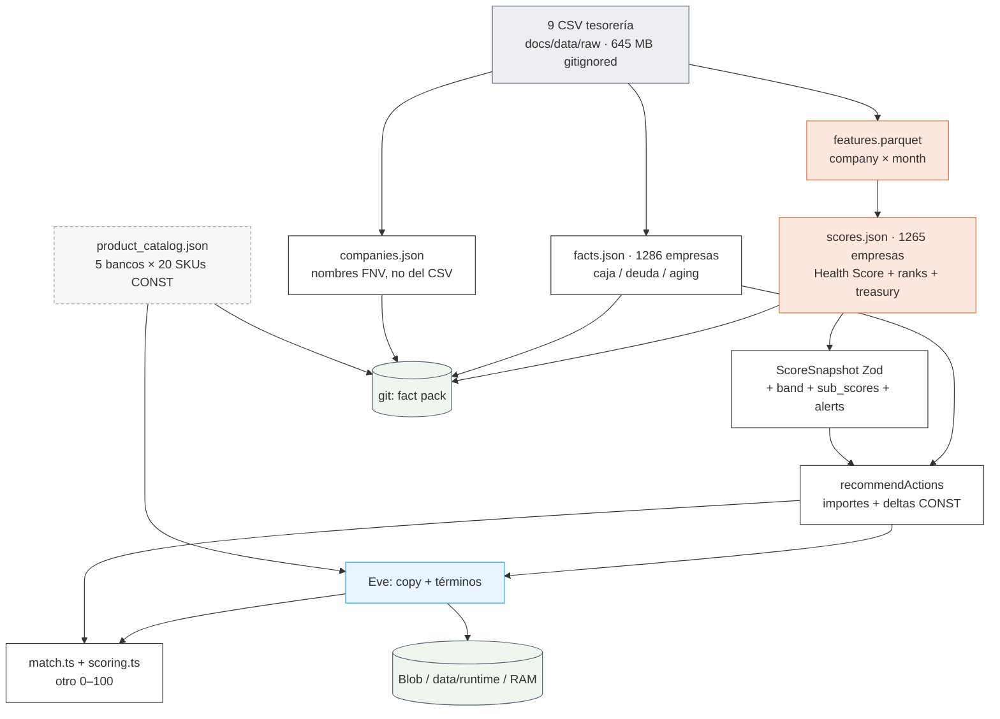

# Auditoría del flujo de datos — X Ray

**Date:** 2026-09-19
**Last updated:** 2026-09-19
**Author(s):** inspección del árbol vivo (código + fact pack committed)
**Status:** Final
**Scope:** inventario de **campos**: qué entra al Health Score, qué sale, qué produce TypeScript, qué produce Eve, qué está inventado, y dónde persiste. Conteos del fact pack actual (`web/lib/xray/dataset/`).
**Fuera de alcance:** calidad estadística del score ([`auditoria_health_score.md`](auditoria_health_score.md), [`model_card.md`](model_card.md)); seguridad ofensiva; pitch.
**Relacionado:** cableado de runtime en [`auditoria_plataforma.md`](auditoria_plataforma.md). Este fichero es el inventario de datos; aquel, el de procesos. Donde choquen, **gana este** (el otro quedó desfasado en proyección Monte Carlo, `treasury`, y el warm cache de `recommendations.json`).

---

## Executive Summary

Hay **dos pipelines paralelos** sobre los mismos CSV, **tres curvas de tipos**, y **dos scores 0–100** en la misma ficha. El LLM no calcula; sí redacta títulos y cotiza términos dentro de un catálogo inventado. El Health Score sí es real (reglas + isotónica sobre tesorería). Casi todo lo “de producto” (banda letra, PD, catálogo, uplift, match, nombres de empresa, comisión Embat) es **constante de código o fórmula TS**, no del dataset.

Conteos del pack committed (19 sep): **1.286** empresas / **250** grupos / **1.265** con Health Score. `watch = null` en el **100 %**. Bandas AAA/AA/A = **0**. Score real recorre **18,6–68,7** (p50 50,7). Tesorería MPC en **1.135** fichas EUR. Contratos con tipo: **39–40** empresas. Catálogo marketplace: **5** entidades × **20** SKUs, escritos a mano.

---

## Cómo leer las etiquetas

| Etiqueta | Significa |
|---|---|
| **CSV** | Sale de los 9 CSV del reto (sintéticos Embat, no inventados por nosotros) |
| **PY** | Lo calcula `xray/` sobre esos CSV |
| **TS** | Lo calcula TypeScript sobre el fact pack / snapshot |
| **UI** | Transformación cosmética de un número real (letra, copy, redondeo) |
| **CONST** | Constante de código; no sale del dataset |
| **PROXY** | Sustituto de una serie que no existe (ceros, 0,85×inflow, anual/4) |
| **LLM** | Texto del modelo; las cifras las pone otro motor |
| **STUB** | Documentado como temporal y sigue en pantalla |
| **MUERTO** | Se calcula y nadie de producto lo lee |

`origin` en JSON es otra taxonomía (`ml` / `deterministic` / `eve` / `llm`). **`ml` es mentira**: el motor es reglas + isotónica. `llm` está en el schema Zod y **nunca se asigna**.

---

## Mapa de un vistazo



---

## 0. Dataset crudo (CSV)

**Fuente:** tesorería sintética Embat, sep-2024 → 2026-09-01. ~645 MB, **gitignored**. Resolución: `XRAY_DATA_DIR` → `docs/data/raw` → `input_data/`. Caché: `artifacts/raw/*.parquet` (local, gitignored).

| Tabla | Qué es | Lo usa el Health Score | Lo usa facts/Eve | Notas |
|---|---|---|---|---|
| `groups` | 250 grupos, `n_companies_in_sample` | rollup opcional | tamaño de grupo en `companies.json` | |
| `companies` | id, group, country (~18 % relleno), currency, `created_at` | universo + moneda | ids, group, country, currency | **Nombre comercial no se usa.** `created_at` llega **vacío** al fact pack (0/1286) |
| `banking_products` | cuentas + bancos | saldo **solo corrientes** | `incumbent_banks` (salta `Other*`) | Líneas de crédito **fuera** del índice |
| `debt_products` | préstamos, líneas, leasing, factoring… | **no** (el índice infiere deuda de movimientos) | `debt_by_type`, bancos | 378 empresas con producto |
| `debt_schedule_config` | 87 contratos / 40 empresas, tipo, plazos | **no** el score; **sí** tesorería MPC (tipo de refinanciar) | `contracts[]`, `implied_debt_rate` | El 97 % del pack no tiene tipo contractual |
| `transactions` | ~2,5 M movimientos | señales i, iii, iv + reconstrucción de saldo | `cash_series`, in/out 3 m | `interest_charge` **no** es el interés de los préstamos |
| `invoices` | ~0,9 M; sin campo dirección | señal ii (`overdue_flow_rate_3m`) | aging + top counterparties | `amount>0` emitida, `<0` recibida. Overdue `payment_date` no es pago |
| `balances` | **una** foto 2026-09-01 | ancla de la reconstrucción hacia atrás | `cash_balance` = **suma de todos los saldos** | Distinto del saldo de corrientes del score |

**También en git (no el dataset grande):**

| Path | Qué |
|---|---|
| `docs/data/raw/new/group/` | Pack demo GROUP_0147 (3 empresas) |
| `docs/data/raw/new/update/` | Pack update COMP_0001 (mes 2026-09 estresado) |
| `docs/data/raw/new/catalog/` | Mirror CSV del catálogo; **la app no lo lee** |
| `docs/data/raw/qa/` | Slices de test `xray-testsets` |

**Limpieza en carga (`xray.data._clean`):** `direction` de facturas; fechas locas → NaT; `ESPAÑA`→`ES`; `transactions.month`. `features.invoice_rows()` quita no-facturas (~15 %) y canceladas (~2 %).

---

## 1. Health Score — qué entra

Seam: `features(company_id, month)` → `labels` → `rules`. Contrato: [`features_seam.md`](features_seam.md). Grano mensual sin huecos; tabla **termina en 2026-08** (septiembre tiene 1 día). 21 empresas sin corriente con saldo en `balances` **fuera** (1.286 → 1.265).

### 1.1 Las cuatro señales del índice (v2, 19 sep)

| # | Columna | Fórmula | Rojo si rango ≤ 0,20 | Peso |
|---|---|---|---|---|
| i | `cash_buffer_days` | `min_balance_eur / (outflows_eur / 30)` | cola baja | 0,35 (`balance`) |
| ii | `overdue_flow_rate_3m` | impagado de lo vencido 3 m / vencido 3 m | cola alta | 0,20 (`overdue`) |
| iii | `dscr_6m` | op. inflows 6 m / (`debt_repayment`+`interest_charge` 6 m) | cola baja | 0,20 (`dscr`) |
| iv | `net_cash_flow_ratio_3m` | (op. inflows − outflows) 3 m / outflows 3 m | cola baja | 0,25 (`inflows`) |

Entradas operativas = `collection` \| `bulk_collection` \| `pos_settlement` \| `cash_settlement`. `has_debt` sale de **movimientos**, no de `debt_products`. NaN nunca es 0 ni rojo.

Rango = percentil **dentro del mes** (1 = más sana). Empresas nuevas (ingest): contra `RankProfile` congelado, no entre ellas.

### 1.2 Columnas que se construyen y el índice **no** lee

Están en `features.parquet` para pantalla / proyección / evals. **No** entran al mapa isotónico:

`operating_inflows_eur`, `outflows_eur`, `eom_balance_eur`, `min_balance_eur`, `months_negative_6m`, `overdue_received_eur`, `received_3m_eur`, `overdue_received_ratio_3m` (señal ii **antigua**), `debt_service_6m_eur`, `inflows_yoy_change` (señal iv antigua; cobertura ~0 % en train), `credit_line_usage`, `top_customer_share_12m`, flags `has_*`.

`credit_line_usage` **sí** lo lee el simulador de tesorería (`projection.company_extras`). `top_customer_share_12m` **no dispara** `watch` (nadie construye `events_ext`).

### 1.3 Lo que el score **no** toma

Sector, nombre comercial, país, tipo contractual, catálogo marketplace, fact pack TS, Eve, bandas letra, PD, `created_at`. Datos públicos web (slice #1): **jamás** un score.

---

## 2. Health Score — qué sale

Cadena: `state_index` (media ponderada de rangos) → `level` (MA 6 m) → `score` = isotónica(level)×100, train ≤ 2025-08. Outlook / trend / confidence / evento. Drivers exactos (`explain`), no SHAP.

CLI: `uv run xray-score` → `artifacts/scores/{scores.parquet, groups.parquet, rules_model.json}`. Demo: `uv run xray-export-web` → `web/lib/xray/dataset/scores.json` (**1.265** filas, 3,9 MB). `origin: "ml"` en todas.

### 2.1 `ExportedScore` — una fila por empresa (último mes con score)

| Campo | Origen | Notas del pack actual |
|---|---|---|
| `company_id`, `month` | PY | 1.156 cierran en 2026-08; 109 cierran antes (inactivas) |
| `score` | PY isotónica | 18,6–68,7; p50 50,7 |
| `level`, `state_index` | PY | van al JSON; la ficha Zod **no** los exige |
| `outlook` | PY | stable 1.069 / negative 129 / positive 67 |
| `trend` | PY; **no toca el score** | flat 1.068 / worsening 101 / improving 96 |
| `watch` | PY desde `events_ext` | **null en 1.265/1.265**. Nadie extrae eventos de los CSV |
| `confidence` | PY (historia × n_signals) | high 666 / medium 576 / low 23 |
| `n_signals`, `n_red`, `months_of_history` | PY | 4 señales: 318; 1 señal: 11. `n_red≥2`: 179 |
| `signals.*` | PY brutos | `dscr_6m` null en 683 (sin servicio de deuda); `<1,2` en 32 |
| `ranks.*` + `rank_balance/overdue/dscr/inflows` | PY | duplicados: nombres de columna vs cortos |
| `dimensions` | PY, **mapeo** | `liq←rank_balance`, `col←rank_overdue`, `debt←rank_dscr`, `act←rank_inflows`, `pay←0,4·overdue+0,6·inflows`. Defaults 0,5 si NaN |
| `peer_percentile` | PY | percentil del score en el mes (export) o vs referencia (ingest) |
| `history[]` | PY | hasta 24 meses `{month, score}`; mediana 19 |
| `drivers[]` | PY filtrado | `\|delta\|≥0,5`, top 6. Vacío en 291 empresas |
| `driver_detail` | PY completo | la ficha **no** lo pinta |
| `projection_6m` {p10,p50,p90} | **STUB** | delta reciente ± spread ad hoc. **No** es Monte Carlo |
| `treasury` | PY `projection`+`policies` | 1.135 empresas EUR. `calibrated: false` siempre. Ver §2.2 |
| `origin` | CONST `"ml"` | |

### 2.2 `treasury` (MPC, slice #6 sí aterrizó)

No confundir con `projection_6m`. Monte Carlo 500 paths × 6 m sobre la historia de **corrientes**. Precios de producto en `SimConfig` (**CONST**, no BdE):

```
line_rate 3,75 % · loan_rates 3,56–3,79 % · factoring 6 % + 0,5 % comisión
overdraft 18 % · refinance closing 75 bps · DSCR floor 1,2
```

Sale: `baseline` (kind=`none`) + `recommended` + `alternatives[]` con `expected_cost`, `breach_prob`, `dscr_fail_prob`, `cash_projection_6m`. Solo EUR con historia suficiente; resto `null`.

Acción recomendada en el pack: `line_open` 717 · `none` 239 · `loan` 106 · `line_cover` 67 · `refinance` 3 · `factoring` 3.

**No está calibrado** (`calibrated: false`). La ficha lo pinta (`TreasuryCard`). El watcher **no** alerta sobre él.

### 2.3 Lo que Python produce y Next **añade** (`snapshotFromExported`)

| Campo ficha | Cómo | Origen |
|---|---|---|
| `band` | umbrales 92/84/76/68/55/42/28/14/0 | **CONST** `bands.ts`. Con el rango real: BB 481, B 478, CCC 238, CC 65, BBB **3**, AAA/AA/A **0** |
| `sub_scores.bankability` | 100·(0,40 liq + 0,35 debt + 0,25 pay) | **TS**, no Python |
| `sub_scores.business_profile` | 100·(0,45 col + 0,55 act) | **TS** |
| `alerts[]` | watch (warning) + DSCR&lt;1,2 (critical) | **TS** sobre campos PY. Watch nunca dispara en el pack |
| `explanation` | frase plantilla con score/banda/drivers/DSCR | **UI** (antes iba `null`) |
| `pd` indicativa | 0,2 %…50 % por banda | **CONST**, no PD realizada |

---

## 3. Fact pack TS — pipeline paralelo (no es el score)

`npm run build:facts` / `facts-builder.ts` (mismo código en import). Lee los CSV otra vez. **No** llama a Python.

`companies.json` (172 KB, 1.286):

| Campo | Origen |
|---|---|
| `company_id`, `group_id`, `country`, `currency` | CSV |
| `n_companies_in_group` | `groups.csv` |
| `name` | **CONST** FNV-1a → «Iberia Distribución 412». El CSV no se consulta |
| `created_at` | CSV, **0/1286 relleno** → peers usan `months_of_history` |

Países sucios en el pack: `ESPAÑA`/`España`/`ESPANYA`/`Spain` conviven (Python sí normaliza a `ES` en carga; `build:facts` **no**). Moneda: 1.149 EUR + 137 no-EUR.

`facts.json` (2,7 MB, 1.286) — `CompanyFacts`:

| Campo | Origen | Cuidado |
|---|---|---|
| `cash_balance` | suma de **todos** los `balances` | ≠ saldo de corrientes del score; 248 empresas en negativo |
| `monthly_inflow/outflow_avg_3m` | tx `booked` 2026-06…08 | inflows **totales**, no solo operativos |
| `incumbent_banks` | banking + debt, max 8, salta `Other*` | CSV |
| `debt_by_type` | `debt_products` | 378 con deuda; 206 con `lineofcredit` |
| `contracts[]` | `debt_schedule_config` ⋈ meta de producto | **40** empresas; tipo en **39** |
| `cash_series[]` | 24 m, meses con tx | CSV |
| `invoice_aging` | pending + due &lt; 2026-09-01 | **no** filtra `document_type` como Python |
| `overdue_flow_rate_3m` (dentro de aging) | pending overdue / received_3m por **issuance** | **otra fórmula** que la señal PY |
| `top_counterparties` | top 5 por \|amount\| | ids, no nombres |
| `implied_debt_rate` | media simple de `annual_rate` de contratos | null en ~1.247 empresas |

`build:facts.mts` calcula `cash_buffer_days` / `dscr_6m` / etc. **en local y los tira**. No se escriben. El Health Score de esos nombres vive solo en `scores.json`.

---

## 4. Lo que produce TypeScript de producto (sin LLM)

### 4.1 Acciones de ficha — `recommendActions`

Reglas sobre facts + signals PY. **El LLM no elige importes.** Top 4 por `weight`. `origin: deterministic`.

| `kind` | Trigger | Importe | `dimension_deltas` |
|---|---|---|---|
| `amortize` | caja ociosa ≥ 10 k y tipo &gt; 0 | min(cash, debt) redondeado a 1 k | debt +0,10, liq −0,04, pay +0,02 |
| `refinance` | contrato &gt; 4,5 %, o implícito &gt; 4,5 %, o DSCR &lt; 1,2 | outstanding caro / deuda | debt +0,12, … |
| `factoring` | emitidas vencidas ≥ 5 k | ese stock | col +0,10, liq +0,08 |
| `confirming` | recibidas vencidas ≥ 5 k | ese stock | pay +0,09, liq +0,05 |
| `extend_line` | línea ≥ 75 % | 25 % del granted | liq +0,10, debt +0,02 |
| `new_debt` | `cash_buffer_days` &lt; 15 | hueco a 15 días de outflows | liq +0,14, debt −0,03, act +0,02 |

Los deltas son **CONST**. No hay simulación de ranks ni reaplicación del mapa isotónico.

`uplift` = `scoreFromDimensions(dims+deltas) − snapshot.score` — **otro 0–100**:

```
0,28·liq + 0,18·col + 0,18·pay + 0,26·debt + 0,10·act
```

El gauge de la ficha es isotónico; el “+3,2 al refinanciar” no.

GET `/api/xray/actions/[id]`: grounded → Eve redacta título/rationale (45 s) → `applyAgentCopy` (pisa copy, **conserva** importe/uplift/deltas) → persiste. Si Eve falla, se sirven las reglas. GET `/api/xray/actions` (portfolio) **no** llama a Eve; overlay de títulos ya guardados.

### 4.2 Marketplace — match y what-if

`match.ts`: `clientFit` (cobertura 0,30 + tipo vs implícito 0,30 + plazo vs ciclo 0,20 + holgura DSCR 0,20) × `issuerAppetite` (banda + ticket + margen). Match = media armónica. Suelo DSCR 1,2.

`fitContextFromFacts` usa facts reales. `defaultFitContext` **inventa** euros desde dimensiones — tests/evals; la demo no debe usarlo.

`reassembleMatches` (camino Eve): tira match/uplift/banda del LLM; clampa términos al catálogo; el POST `amount` **pisa** el del agente.

`deterministicMarketplace`: si Eve peta. SKUs del catálogo, `origin: deterministic`. **No se cachea** (para que un retry sí llame a Eve).

### 4.3 Catálogo y tres curvas de tipos

`product_catalog.json` (**CONST**, 12 KB): 5 entidades (BBVA, Santander, Sabadell, March, Embat Capital Desk) × 20 SKUs. Kinds: new_debt 5, refinance 5, extend_line 4, factoring 3, confirming 3. No hay SKU `amortize`. Mirror CSV en `docs/data/raw/new/catalog/` **no se carga**.

Tres tablas de “tipo justo”, incompatibles:

| Dónde | AAA…C (aprox.) | Quién la usa |
|---|---|---|
| `catalog.fairRateForBand` | 2,8 % … 13 % | fallback marketplace, `warm:recommendations` |
| `offering/get_rate_context.ts` | 2,5 % … 12 % | subagente offering |
| `projection.SimConfig.loan_rates` | 3,56–3,79 % por tramo de ticket | MPC tesorería |

Ninguna sale del dataset ni de BdE. `xray/rates` **no existe**.

### 4.4 Otros derivados TS

| Superficie | Qué | Origen |
|---|---|---|
| Dashboard KPIs | n, media, caja suma, outlook, histograma, top/bottom | rollup de summaries |
| `CompanySummary.situation` | “Deuda cara” si tipo ≥ 5 %; “Vence en N meses” si `total_periods` ≤ 12 | facts. 97 % sale “—” |
| Group score | ponderado por `monthly_inflow_avg_3m` (suelo 1 €) | espejo de `explain.group_rollup`; **no** es caja consolidada |
| Group **name** | regex holding\|grupo\|group sobre nombres FNV, si no la de mayor score | **CONST/UI** |
| Peers | k=15, tamaño = in+out 3 m, edad = history (created_at vacío) | TS. Pool misma moneda si cabe |
| Compare | alinea `history` de 2–3 empresas | PY scores |
| Book productos | `facts.contracts` + deals aceptados | CSV + store |
| Negotiation levers | hueco issuer vs client_ideal | **TS**; `match_delta` CONST 0,08/0,04/… |
| Term improvements | tips cobros/pagos/DSCR | **TS** |
| Ofertas UI | ahorro anual `(tipo_actual − oferta)×ticket`; comisión Embat **3 %** | `offer-metrics.ts` **CONST** |
| Watch queue | `evaluateWatch`: DSCR&lt;1,2, outlook+trend, `watch≠null` | TS sobre snapshot PY |
| Import packs | sha256 → scores precomputados | `import_packs.json` (2 packs: group, update) |

`recommendations.json` (89 KB, 16 keys, grupo demo + calibración): **no entra** en `POST /api/xray/recommend`. Solo evals (`npm run calibrate` / `warm:recommendations`). [`auditoria_plataforma.md`](auditoria_plataforma.md) §6.7 está desfasada aquí.

---

## 5. Lo que producen las IAs y agentes

Modelo: Helmcode. Ficha/chat = `glm5.3`. Marketplace = `deepseek-v4-flash`. Auth: OIDC Vercel + `localDev` + `placeholderAuth`. **Sin auth de producto.**

Regla: *You never calculate.* En la práctica el **servidor** sí recalcula match/uplift; el modelo no debe.

### 5.1 Eve analista — tools (solo leen)

| Tool | Qué devuelve | Trampa |
|---|---|---|
| `get_company_overview` | métricas “pipeline CSV” por moneda | `fee_outflow`, `loc_*`, `debt_repayment_outflow`, duplicates, reconciliation = **PROXY "0"**. `interest_charge_outflow` = interés anual de contratos **/ 4**. `compact()` **borra** los ceros, así que a veces no se citan |
| `get_working_capital_series` | serie mensual | `collection_inflow = 0,85×inflow`, `debt_service_outflow = 0,05×outflow`, `receivables_overdue_90d = 0,4×overdue` — **PROXY**. Caja reconstruida hacia atrás desde `facts.cash_balance` (deriva) |
| `get_opportunities` | screens idle cash / overdue / refinancing | solo 3 tipos se emiten; el schema admite 9 (fees, duplicates, refunds… **muertos**) |
| `get_peer_percentiles` | p10…p90 de una métrica | percentiles sobre el reshape con ceros → distorsión si no `exclude_zero_peers` |
| `get_recommended_actions` | mismas acciones que la ficha + `treasury` | cifras grounded; copy no |
| `get_refinancing_rate_benchmark` | percentil de tipos contractuales | solo 87 contratos; la mayoría “no hay schedule” |
| `get_group_netting` | caja vs deuda intra-grupo | proxy de offset, no netting legal |

### 5.2 Subagentes marketplace

```
quantity → offering → match
```

| Etapa | Puede emitir | El servidor se queda con | Tira |
|---|---|---|---|
| `quantity` | `ideal_amount`, min/max, `ceiling_reason`, rationale, risks | amount (si el POST no trae otro) + textos | — |
| `offering` | `product_id` (FK catálogo), términos puntuales, `issuer_rationale` | ids + términos **clampeados** al SKU | SKUs inventados |
| `match` | ranking + rationale/risks + match% del tool | textos y orden | **match%, uplift, banda** (recompute TS) |
| orquestador | `headline` | headline | cifras de ProductMatch |

Tools deterministas dentro: `solve_amount`, `propose_terms`, `compute_match`, `project_uplift`, `list_catalog_products`. `solve_amount` usa un producto dummy a 4 % / 36 m solo para el solver.

Timeout Eve recommend: 240 s. Fallback: motor TS.

### 5.3 Eve en la ficha de acciones

Output schema: `{kind, title, rationale, reasoning?}`. `applyAgentCopy` exige que `kind` exista en el grounded. `origin` pasa a `"eve"` aunque los euros sean reglas.

### 5.4 Watcher

Gate **TS** (`evaluateWatch`). El LLM solo redacta `copy` de canal. Dedupe `(company_id, rule_id, month)`. Cron laborables 07:00 UTC, máx. 8 empresas. Fan-out Slack/Resend si hay env. `watch_event` **nunca** pega en el pack (watch null). Quedan `dscr_floor` (32 empresas) y `outlook_negative_worsening`.

### 5.5 Chat

Transcripciones = sesiones Eve (`/chat`, `/s/:id`), **fuera** de `lib/xray/store.ts`. No hay Postgres. Self-mod subagente = plantilla, no producto.

### 5.6 Lo que el LLM **no** produce (y a veces parece que sí)

Score, ranks, outlook, trend, watch, importes de acción, match %, uplift, banda proyectada, SKUs, PD, KPIs de dashboard, book de deuda.

---

## 6. Persistencia — dónde vive cada cosa

Tres tiers de `store.ts` (mutable de demo):

1. **Vercel Blob** si `BLOB_READ_WRITE_TOKEN`
2. **`web/data/runtime/`** en local (`XRAY_RUNTIME_DIR`); gitignored salvo README. **Desactivado en Vercel** (FS read-only)
3. **Maps de proceso** si no hay ni Blob ni FS

| Dato | Dónde | Sobrevive a | Quién escribe |
|---|---|---|---|
| CSV crudo 645 MB | disco local / `XRAY_DATA_DIR` | máquina | Embat |
| parquet + `rules_model.json` + `scores.parquet` | `artifacts/` gitignored | máquina | CLIs Python |
| `companies.json` `facts.json` `scores.json` | **git** | deploy Vercel | `build:facts` + `xray-export-web` |
| `product_catalog.json` | **git** | deploy | mano |
| `import_packs.json` | **git** | deploy | `xray-prescore-packs` |
| `recommendations.json` | **git** | deploy | `warm:recommendations` — **no** lo lee el recommend live |
| `xray/session.json` | Blob / runtime | demo | `/start` (grupo foco; **no filtra** `/` ni empresas) |
| `xray/imports/{id}.json` | Blob / runtime | demo | POST import. Gana sobre el pack en snapshot/facts/acciones |
| `xray/import-csvs/{id}.json` | Blob / runtime | demo | POST import. Tablas canónicas; deal approve las muta y re-llama `POST /ingest` |
| `xray/recommendations/{company:action}.json` | Blob / runtime | demo | POST recommend (solo si no hay `amount`) |
| `xray/actions/{id}.json` | Blob / runtime | demo | GET ficha actions (Eve o grounded) |
| `xray/deals/{id}.json` | Blob / runtime | demo | PUT deal (1 por empresa) |
| `xray/alerts/{key}.json` | Blob (alert-log; **no** FS runtime) | demo + cold start si Blob | watcher |
| Cache recommend in-memory | proceso | request/instancia | recommend route |
| Slack webhook de Ajustes | **RAM proceso** (o `SLACK_WEBHOOK_URL`) | nada / env | settings. **No** va a Blob a propósito |
| Chat Eve | store de Eve | según Eve/Vercel | agente |
| IDs importados en cliente | **no** hay `localStorage` de imports hoy | — | el AGENTS viejo lo mencionaba; el código no |
| Supabase | deps en `package.json` | — | **0 call sites** |
| Postgres | — | — | no hay |

**Import en Vercel:** tope 4,5 MB. Si `XRAY_API_URL` no responde, sha256 contra `import_packs.json`. CSV editado ≠ pack. FastAPI `POST /ingest` (local/túnel) puntúa contra `rules_model.json` y `peer_ref`.

Reset `/start`: pisa sesión, borra deals/acciones del grupo.

---

## 7. Matriz mockeado vs real

“Mock” aquí = no sale de la tesorería de esa empresa.

| Dato en pantalla | ¿Real de tesorería? | Qué es |
|---|---|---|
| Health Score 0–100, outlook, trend, confidence, ranks, signals, drivers, history | **Sí** | PY |
| `projection_6m` p10/p50/p90 | **No** | STUB sobre delta del score |
| Tesorería MPC (breach, coste, acción) | **Parcial** | MC sobre flujos reales + **precios CONST** + `calibrated: false` |
| Banda AAA–C y PD | **No** | umbrales CONST; el número no llega a AAA |
| Sub-scores bancabilidad / negocio | **Derivado** | pesos CONST sobre ranks reales |
| Nombre de empresa / grupo | **No** | hash FNV |
| País / moneda / ids | **Sí** | CSV (país sucio en facts) |
| Caja, series, aging, contratos, bancos | **Sí** (con matices §3) | facts TS ≠ features PY |
| Acciones: importe y por qué | **Reglas sobre facts reales** | deltas CONST |
| Uplift / score proyectado de producto | **No el Health Score** | otro modelo TS |
| Productos del marketplace | **No** | catálogo CONST |
| Términos cotizados | **Rangos CONST** + LLM dentro | clamp al SKU |
| Match % | **Fórmula TS** | no dataset de deals |
| Comisión Embat 3 % | **No** | CONST Figma |
| Watch de vencimiento / cliente / deuda cara | **Vacío** | `events_ext` no se construye |
| Nombres de tools `fee_outflow=0`, `loc_*=0` | **No observado** | PROXY; `compact` los oculta |
| Serie WC `0,85` / `0,05` / `0,40` | **No** | PROXY |
| Peers | **Sí** tamaño/score; edad = historia | created_at vacío |
| Deals contratados | **Estado de demo** | store, no banco |
| Alertas Slack | **Reglas reales** sobre snapshot | copy LLM opcional |
| Auth / multi-asesor | **No** | placeholder |

No hay `mockProvider`. La cartera no es un array inventado: es el dataset. Lo inventado es la **capa de producto** encima.

---

## 8. Decisiones que este inventario abre

Priorizadas por coste de mentir en demo / jurado.

| # | Pregunta | Hecho | Opciones cortas |
|---|---|---|---|
| 1 | ¿Un score o dos? | Gauge = isotónica; uplift = `scoreFromDimensions` | Etiquetar uplift como what-if de dimensiones **o** reaplicar el mapa tras simular ranks |
| 2 | ¿`projection_6m` o `treasury`? | Los dos están en ficha. Uno es stub; el otro MC no calibrado | Esconder el stub **o** sustituirlo por cuantiles de etiqueta \| nivel (`model_card` §4) |
| 3 | ¿Tres curvas de tipos? | catalog / offering tool / `SimConfig` | Una tabla, o `xray/rates` de verdad, o decir “hint no BdE” en UI |
| 4 | ¿Watch en el pitch? | 0/1265 | Extraer `events_ext` de features **o** quitar el campo de la ficha |
| 5 | ¿Nombres FNV? | CSV no se usa | Dejar (anonimiza) **o** un diccionario demo para GROUP_0147 |
| 6 | ¿Facts TS vs features PY? | dos `overdue_flow_rate_3m`, dos cajas | Un solo builder **o** documentar “facts ≠ score” en UI |
| 7 | ¿Catálogo CONST? | 20 SKUs, 5 marcas | OK para demo; no venderlo como matching a ofertas reales |
| 8 | ¿Ceros en tools Eve? | loc/fees/duplicates | Omitir campo (NaN) en vez de `"0"` — `compact` ya ayuda |
| 9 | ¿`origin: ml`? | es reglas | Renombrar a `rules` / `health_scorer` |
| 10 | ¿Persistencia post-hackathon? | Blob JSON, 0 Postgres, Supabase muerto | Cablear watchlist **o** borrar deps |
| 11 | ¿Import en Vercel? | prescored sha256 o túnel Python | Dockerfile ingest **o** solo packs demo |
| 12 | ¿Comisión 3 % y PD de banda? | Figma / a mano | Quitar de pantalla **o** disclaimer “indicativo” |
| 13 | ¿Deltas de acción CONST? | +0,12 debt etc. | Dejar y no compararlos con el gauge **o** ligarlos a `treasury.alternatives` |
| 14 | ¿`created_at`? | 0 relleno; peers usan history | Rellenar del CSV si existe **o** asumir edad = historia en copy |
| 15 | ¿País sucio en companies.json? | `ESPAÑA` vs `ES` | Reusar `_clean` de Python en `build:facts` |

---

## 9. Regenerar / invalidar

```bash
uv run xray-cache              # CSV → artifacts/raw
uv run xray-features           # → artifacts/features.parquet
uv run xray-score              # → artifacts/scores/*
uv run xray-export-web         # → scores.json  (Health Score + treasury)
cd web && npm run build:facts  # → companies.json + facts.json
cd web && npm run warm:recommendations  # evals, no el live path
uv run xray-prescore-packs     # → import_packs.json
uv run xray-demopacks          # → docs/data/raw/new/{group,update,catalog}
```

Un CSV nuevo **no** mueve la demo hasta export + build:facts (y commit, en Vercel). Un import live **sí** pisa esa empresa en Blob/runtime.

---

## Appendix A — Conteos del pack (19 sep 2026)

| Métrica | Valor |
|---|---|
| Empresas / grupos / scored | 1.286 / 250 / 1.265 |
| EUR / no-EUR | 1.149 / 137 |
| Con producto de deuda / con contrato / con tipo | 378 / 40 / 39 |
| Con línea de crédito | 206 |
| `cash_balance` &lt; 0 (facts) | 248 |
| `watch` no null | 0 |
| `treasury` presente | 1.135 |
| Score min / p50 / max | 18,6 / 50,7 / 68,7 |
| Bandas AAA–A / BBB / BB / B / CCC / CC | 0 / 3 / 481 / 478 / 238 / 65 |
| Outlook − / = / + | 129 / 1.069 / 67 |
| DSCR null / &lt; 1,2 | 683 / 32 |
| Tamaño JSON scores / facts / companies | 3.873 / 2.665 / 172 KB |
| Catálogo | 5 entidades, 20 SKUs |
| Warm recs | 16 keys |
| Packs prescored | `group`, `update` |

## Appendix B — Rutas que leen cada store

| API | Pack git | Import Blob | Eve | Motor TS |
|---|---|---|---|---|
| `GET /api/xray/score/:id` | sí | gana | no | band/alerts |
| `GET /api/xray/companies` | sí | overlay | no | band |
| `GET /api/xray/actions/:id` | sí | facts/score | copy | grounded |
| `GET /api/xray/actions` | sí | overlay | títulos cacheados | grounded |
| `POST /api/xray/recommend` | sí | facts; **salta** Blob recs si import | pipeline | fallback |
| `GET /api/xray/book` | contracts | overlay | no | + deals |
| `GET/PUT /api/xray/deals/:id` | no | no | no | store |
| `POST /api/xray/import` | prescored fallback | escribe | no | facts-builder + Python o pack |
| `GET /api/xray/watch` | scores | overlay | no | evaluateWatch |
| Tools Eve | pack | overlay live | lectura | reshape PROXY |

## Appendix C — Related

- Cableado: [`auditoria_plataforma.md`](auditoria_plataforma.md)
- Calidad del número: [`auditoria_health_score.md`](auditoria_health_score.md), [`model_card.md`](model_card.md)
- Contrato features: [`features_seam.md`](features_seam.md)
- Front: [`frontend_v0.md`](frontend_v0.md)
- Watcher: [`watcher_agent.md`](watcher_agent.md)
- Calibración Eve: [`calibration.md`](calibration.md)
