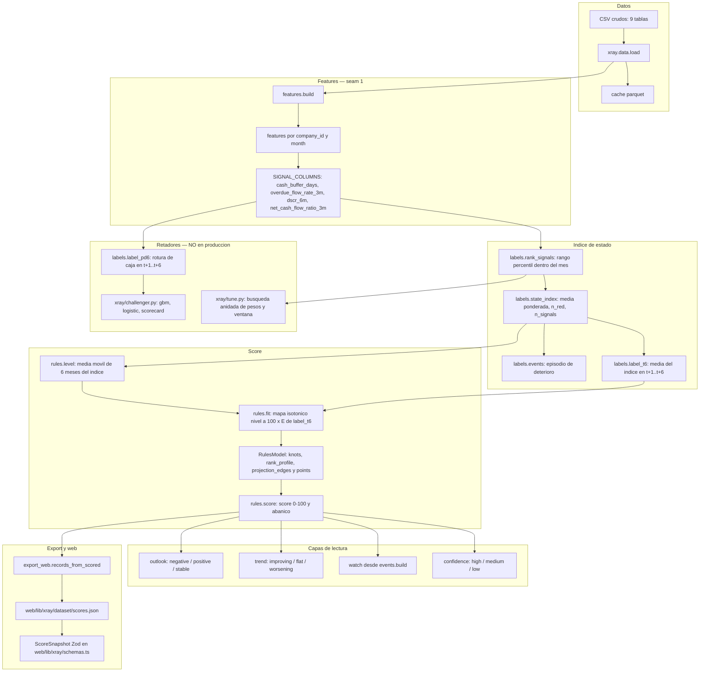
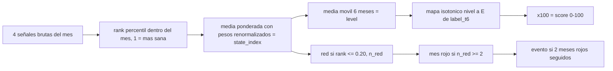
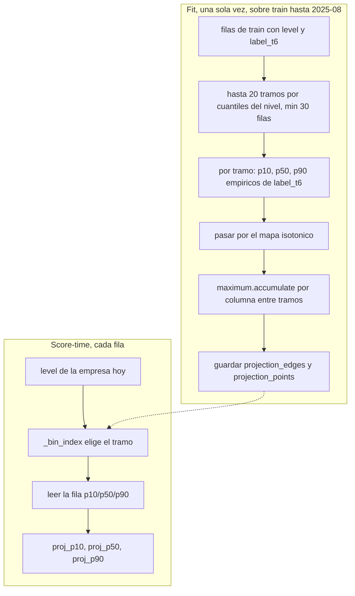
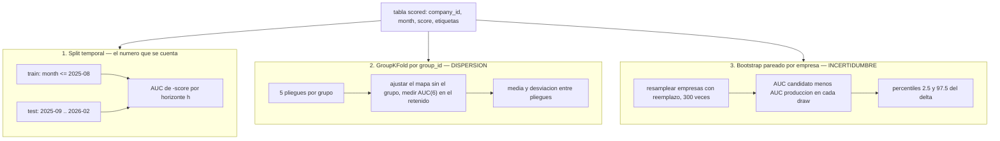

# Arquitectura del modelo X Ray

> Escrito el 20 sep 2026 sobre la rama CalvoSeko/ML-experiments; describe el runtime, no el diseño del plan.

Tres cosas: cómo se calcula el score de punta a punta, cómo se estima el abanico `projection_6m`, y
qué significan las dos cosas distintas que aquí se llaman «confianza». Todo está leído del código de
esta rama; donde una cifra viene de un doc medido, se cita el fichero.

## 1. Pipeline

### 1.1 Vista completa



### 1.2 Qué hace cada paso

**`xray.data.load()`** carga los nueve CSV, aplica la dirección de las facturas por el signo de
`amount` y usa la caché parquet. Nada del pipeline lee los CSV directamente.

**`xray.features.build()`** produce la tabla `features(company_id, month)`, el primer seam. Una fila
por empresa y mes natural con movimiento. El contrato está en `COLUMNS` (claves, flujos, saldo,
proveedores, servicio de deuda, señales v2, banderas `has_*`, cobertura). Las cuatro señales que
lee el índice son `SIGNAL_COLUMNS`:

| Nombre corto | Columna de features | `ascending` | Sentido |
|---|---|---|---|
| `balance` | `cash_buffer_days` | `True` | Más días de caja es más sano |
| `overdue` | `overdue_flow_rate_3m` | `False` | Más vencido impagado es menos sano |
| `dscr` | `dscr_6m` | `True` | Más cobertura del servicio de deuda es más sano |
| `inflows` | `net_cash_flow_ratio_3m` | `True` | Más flujo neto es más sano |

El mapeo vive en `labels.SIGNALS`. La tabla va en euros y ratios brutos; el rango percentil se
calcula aguas abajo, porque la reconstrucción de saldo deriva.

**`labels.rank_signals`** convierte cada señal en su rango percentil **dentro del mes**, orientado a
1 = más sana, empates por media, NaN excluidos del rango. Con un `RankProfile` (`xray/profile.py`)
las filas se ranquean contra una población de referencia congelada en el modelo en vez de entre
ellas: es el camino de las empresas nuevas del ingest.

**`labels.state_index`** marca rojo cada señal con rango ≤ `red_cutoff`, cuenta `n_red` y
`n_signals`, y calcula el índice como media ponderada de los rangos disponibles con los pesos
**renormalizados sobre las señales presentes**. Con menos de `min_signals` señales el índice es NaN.
NaN nunca es rojo.

**`labels.events`** define el episodio de deterioro: mes rojo es `n_red >= red_month_min`; un evento
es el primer mes de una racha de al menos `event_run` meses rojos seguidos. Una racha separada de la
anterior por menos de `event_gap` meses verdes es **el mismo episodio** y no genera evento nuevo
(`_episodes`). `in_event` marca los meses dentro del episodio.

**`labels.label_t6`** es la etiqueta continua: media del índice en t+1…t+`horizon`, NaN si falta
cualquiera de los seis meses. **`rules.level`** es la media móvil de `level_window` meses del índice
por empresa, con `min_periods=1`; se anula donde el índice es NaN.

**`rules.fit`** ajusta una `IsotonicRegression` de `level` sobre `label_t6` con las filas
`month <= train_until` (por defecto `2025-08`) que tengan ambas, con `y_min=0`, `y_max=1` y
`out_of_bounds="clip"`. Los nudos se guardan en `RulesModel.knots_x` / `knots_y`, estos últimos
multiplicados por 100: el score es `np.interp` sobre esos nudos. `fit` guarda además el
`rank_profile` (ajustado sobre **todos** los meses, no solo train), el `lead_cutoff` (percentil
`lead_percentile` de los scores de train) y los nudos del abanico (§2).

**`rules.score`** añade sobre la tabla con nivel: `score`, `proj_p10/p50/p90`, `outlook`, `trend`,
`watch` y `confidence`. `rules.run` encadena todo: `rank_signals → state_index → events → label_t6 →
level → fit (si no recibe modelo) → score`.

**Identidad que hace todo legible**: como `level_window == horizon`, el nivel en t+6 **es** la
etiqueta de t, así que el score de dentro de seis meses es el mapa aplicado a `label_t6` (diferencia
0,000 en 13.682 filas; `docs/specs/rules-spec.md` §11 y `tests/test_rules.py` lo afirman).

**`export_web.records_from_scored`** toma la última fila con score de cada empresa y emite un
registro con `score`, `level`, `state_index`, `outlook`, `trend`, `watch`, `confidence`,
`n_signals`, `n_red`, `months_of_history`, las cuatro señales brutas y sus cuatro rangos,
`dimensions`, `peer_percentile`, la `history` de 24 meses, los `drivers` de `xray.explain`,
`projection_6m` y el bloque `treasury`. Sale a `web/lib/xray/dataset/scores.json` y lo valida
`ScoreSnapshot` (Zod) en `web/lib/xray/schemas.ts`.

### 1.3 De una fila a un número



### 1.4 Parámetros de `RulesConfig` (valores por defecto, `xray/rules.py`)

| Parámetro | Valor | Qué controla |
|---|---|---|
| `weights` | `balance` 0,50 · `inflows` 0,30 · `dscr` 0,10 · `overdue` 0,10 | Pesos del índice; se renormalizan sobre las señales presentes. Ver la nota de abajo |
| `red_cutoff` | 0,20 | Rango ≤ 0,20 es bandera roja |
| `min_signals` | 1 | Señales mínimas para que exista índice |
| `red_month_min` | 2 | `n_red >= 2` es mes rojo |
| `event_run` | 2 | Meses rojos seguidos para abrir un evento |
| `event_gap` | 2 | Verdes seguidos necesarios para que la siguiente racha sea otro episodio |
| `horizon` | 6 | Meses de la etiqueta `label_t6` |
| `level_window` | 6 | Media móvil del índice |
| `outlook_window` | 6 | Ventana del outlook |
| `outlook_negative_min` | 3 | Rojos en la ventana, con t rojo, para `negative` |
| `outlook_greens` | 3 | Últimos verdes seguidos para `positive` |
| `outlook_streak_min` | 1 | Rojos en los 3 anteriores para que cuente como racha |
| `trend_window` | 3 | Meses de (índice − nivel) que promedia `trend` |
| `trend_threshold` | 0,10 | Umbral de \|momentum\| para dejar de ser `flat` |
| `watch_months` | 3 | Meses que dura un watch, el del evento incluido |
| `lead_percentile` | 20,0 | Percentil de scores de train que define `lead_cutoff` |
| `projection_bins` | 20 | Tramos de nivel del abanico |
| `projection_min_rows` | 30 | Filas de train mínimas por tramo |
| `projection_quantiles` | (0,10 · 0,50 · 0,90) | Cuantiles del abanico |
| `confidence_high` | (12, 3) | `months_of_history` y `n_signals` mínimos para `high` |
| `confidence_medium` | (6, 2) | Los mismos para `medium` |

> **Nota sobre los pesos (20 sep 2026).** En `HEAD` los pesos siguen siendo los «por orden de
> evidencia», `0,35/0,25/0,20/0,20`. El árbol de trabajo de esta rama tiene un cambio **sin
> commitear** que adopta la variante `cv_best_min10` aprendida por CV anidada,
> `0,50/0,30/0,10/0,10`, y que a la vez mueve `tune.PRODUCTION_WEIGHTS` y añade
> `tune.LEGACY_WEIGHTS` con los antiguos. La tabla recoge el árbol de trabajo; las cifras de §3.b
> se midieron con los antiguos como referencia de producción.

### 1.5 Los retadores de esta rama (no están en producción)

Ninguna pieza de `xray/challenger.py` ni de `xray/tune.py` entra en `rules.score`, `export_web` ni
en el contrato `ScoreSnapshot`.

- **`labels.label_pd6`**: etiqueta binaria distinta de `label_t6` — «empieza un episodio de rotura de
  caja en (t, t+6]», rotura = `min_balance_eur < 0` dos meses seguidos (`labels.breach_state`);
  elegibles las filas con saldo mínimo ≥ 0 en t. Es la única etiqueta absoluta en euros que el score
  no construye.
- **`xray/challenger.py`** ajusta tres modelos sobre la misma matriz de 16 variables (los cuatro
  rangos, nivel, momentum, `n_red`, meses en negativo, las cuatro señales crudas, uso de línea,
  antigüedad, tamaño y concentración): `gbm` (LightGBM con restricciones de monotonía declaradas en
  el dict `FEATURES`), `logistic` y `scorecard` (logístico sobre siete variables no colineales).
  `uv run xray-evals --challenger`.
- **`xray/tune.py`** busca pesos y ventana por CV anidada: outer = el split temporal de producción,
  inner = `GroupKFold(5)` por `group_id` dentro de train; rejilla del simplex con paso 0,05
  (1.771 puntos) × ventanas L ∈ {1, 2, 3, 6}. Se corre con `uv run xray-evals --tune`.

## 2. Cómo se estima la proyección a 6 meses

`projection_6m` es el trío p10/p50/p90 del **score** dentro de seis meses, en puntos 0–100. Lo produce
`rules.score` como `rules.PROJECTION_COLUMNS = ["proj_p10","proj_p50","proj_p90"]` y lo emite
`export_web._projection_from_row` redondeado a un decimal.

### 2.1 Fit: `rules._fit_projection`

1. Toma las filas de train (las mismas que ajustan el mapa: `month <= train_until`, con `level` y
   `label_t6`).
2. Calcula el número de tramos como `max(1, min(projection_bins, len(train) // projection_min_rows))`:
   como mucho 20 tramos, y nunca más de los que dejan al menos 30 filas de train por tramo.
3. Los cortes son los **cuantiles del nivel** en train: `np.quantile(level, linspace(0, 1, bins+1))`,
   deduplicados con `np.unique`. Se guardan en `RulesModel.projection_edges`.
4. Para cada tramo toma las `label_t6` de sus filas y calcula los cuantiles empíricos
   `projection_quantiles`. Si un tramo se queda vacío, usa la etiqueta de todo train.
5. Pasa esos tres cuantiles por el mapa isotónico (`model.predict`). Aquí es donde la identidad de
   §1.2 hace el trabajo: como `nivel(t+6) = etiqueta(t)` y el mapa es monótono, los cuantiles de la
   etiqueta pasados por el mapa **son** los cuantiles del score dentro de seis meses. No se simula
   nada.
6. Monotoniza: `np.maximum.accumulate(points, axis=0)`, es decir **por columna, a lo largo de los
   tramos**, no dentro de la fila. Cada uno de p10, p50 y p90 queda no decreciente al subir el
   tramo de nivel. El orden dentro de la fila se conserva porque el máximo acumulado de p10 nunca
   pasa al de p50. El commit `49546a1` lo introdujo tras ver que en datos reales el tramo más alto
   daba un p50 de 63,4 frente a 64,6 del anterior; la cobertura apenas se movió (83,2 % contra
   83,4 % en la medición de ese commit).

### 2.2 Serve: `RulesModel.project`

`_bin_index(edges, x) = clip(searchsorted(edges[1:-1], x, side="right"), 0, len(edges)-2)` — la
**misma** función en fit y en serve, extraída para que no se dupliquen dos expresiones que tienen que
coincidir. Se lee la fila de `projection_points` del tramo y se devuelve tal cual; un nivel NaN da
una fila NaN. `RulesModel.load` rechaza un modelo sin proyección o con puntos incoherentes con los
cortes.



### 2.3 Qué dice y qué no dice el abanico

**Dice**: lo que le pasó históricamente a las empresas que estaban donde estás tú. Es una
distribución empírica condicionada **solo** al tramo de nivel, leída sobre el periodo de train.

**No dice**:

- No es una simulación. No hay trayectorias de caja ni un re-scoring de escenarios; son cuantiles
  empíricos de una tabla.
- No está condicionado a la historia propia más allá del nivel de hoy: dos empresas con el mismo
  nivel y trayectorias opuestas reciben el mismo abanico. `outlook`, `trend` y `watch` no entran.
- Los rangos futuros se miden contra la población de **hoy**: el índice es relativo dentro del mes,
  así que el abanico no habla de euros ni de una mejora absoluta del negocio.
- El centro no es el score de hoy: la reversión a la media de una media de seis meses es real
  (`docs/specs/rules-spec.md` §12.1 mide p50 − score medio de +0,4 pts en la cartera).

### 2.4 Cómo se evalúa: `evals.projection_metrics`

Sobre las filas de test (`evals.TEST_MONTHS` = 2025-09 … 2026-02) que tienen score, abanico y score
realizado a t+6 (`y = score.shift(-horizon)` por empresa):

| Métrica | Definición en el código |
|---|---|
| `coverage_80` | `mean((y >= p10) & (y <= p90))` — fracción de realizaciones dentro de la banda del 80 % |
| `mean_width` | `mean(p90 - p10)` en puntos |
| `mae_p50` | `mean(abs(y - p50))` |
| `pinball` | media de las tres pérdidas pinball en τ = 0,1 / 0,5 / 0,9 |

Se reportan además `coverage_80_by_outlook` y `coverage_80_by_history`, y una **base martingala** que
cualquier proyección tiene que batir: centro = score de hoy, banda = score de hoy más los cuantiles
0,1 / 0,9 del cambio a seis meses por tramo de score, ajustados en train y recortados a [0, 100].

Medido en test (`docs/specs/rules-spec.md` §12.1 y §11, y `artifacts/evals/metrics.json` de esta
rama, n = 5.907): **cobertura 82,8 %**, anchura media 17,5 pts, MAE de la mediana 5,8 pts, pinball
1,845 frente a **1,853** de la base martingala. Lectura: el abanico calibra bien — 82,8 % frente al
80 % nominal — pero gana a la base por muy poco, porque el centro ya se movía a la etiqueta
esperada. Cobertura por outlook: 89 % en `negative`, 83 % en `stable`, 74 % en `positive`; por
historial: 76 % con menos de 6 meses, 86 % con 6–11, 84 % con 12 o más.

## 3. Confianza (campo `confidence`) e intervalos de confianza (evaluación)

Dos cosas distintas: una viaja en la ficha de cada empresa y habla de cobertura de datos; la otra
vive en los docs de medición y habla de incertidumbre estadística de una métrica agregada.

### 3.a El campo `confidence` de la ficha

`rules.confidence` es tres líneas: dos umbrales sobre `months_of_history` y `n_signals`.

```python
high   = (months_of_history >= 12) & (n_signals >= 3)   # confidence_high  = (12, 3)
medium = (months_of_history >= 6)  & (n_signals >= 2)   # confidence_medium = (6, 2)
# en otro caso: "low"
```

`np.select([high, medium], ["high","medium"], default="low")`, evaluado en ese orden: una fila que
cumple `high` no se vuelve a mirar. `months_of_history` viene de la tabla de features (meses activos
de la empresa hasta este incluido); `n_signals` es el número de las cuatro señales no NaN en ese mes,
calculado en `labels.state_index`.

**Qué no es**: no es un intervalo, ni una varianza, ni una probabilidad. Es una **bandera de
cobertura de datos**. Con `min_signals = 1` una empresa puede tener score con una sola señal — la
decisión del 19 sep para no dejar al 19 % de las filas sin score — y `confidence` es lo que avisa. No
mide si el score es correcto: una empresa con doce meses y cuatro señales sale `high` aunque su
score esté mal.

**En la web**: `ScoreSnapshot` lo valida con `ConfidenceSchema = z.enum(["high","medium","low"])`
(`web/lib/xray/schemas.ts:17`, usado en la línea 113 del snapshot). La ficha lo pinta en el
subtítulo del índice de salud: `Índice de salud · confianza ${snapshot.confidence} · …`
(`web/components/xray/score-overview.tsx`).

**Reparto medido** (`docs/references/model-card.md`, tabla «Reparto»): alta 31 %, media 38 %, baja 31 %; cuatro
señales en el 25 % de las filas, tres en el 50 %, dos en el 24 %.

### 3.b Intervalos de confianza en la evaluación



**1. El split temporal** es el número que se cuenta. `evals.TRAIN_UNTIL = "2025-08"`,
`evals.TEST_MONTHS` = los seis meses 2025-09 … 2026-02. Hay dos curvas de AUC: `auc_by_horizon`
(evento propio, salido de los mismos rangos que el score promedia — mide sobre todo persistencia) y
`auc_external_by_horizon` («el saldo mínimo bruto pasa a negativo en (t, t+h]», entre filas con
saldo ≥ 0 en t), que es la cifra de anticipación porque usa un resultado que el score no construye.

**2. `evals.group_kfold_auc6` es dispersión, no generalización.** Su docstring lo dice literalmente:

> «Es una estimación de DISPERSIÓN, no de generalización: el mapa isotónico es monótono, así que el
> AUC no depende del ajuste y lo que varía entre pliegues es la subpoblación (19 sep). Solo mediría
> generalización si se ajustaran los pesos del índice.»

Es decir: reajustar el mapa quitando un grupo no puede reordenar a las empresas, porque una función
monótona conserva el orden y el AUC solo depende del orden. Lo que cambia entre pliegues es **qué
empresas** se evalúan. Medido para las reglas: dispersión por grupos 0,69 ± 0,05 sobre la etiqueta
externa (`docs/specs/rules-spec.md` §11) y 0,734 ± 0,022 sobre PD6
(`docs/research/2026-09-20-retador-gbm-pd6.md` §2). El `metrics.json` lo guarda bajo
`auc6_group_dispersion` con esa misma nota.

**3. El bootstrap pareado por empresa** (`tune.compare`, y el mismo protocolo detrás de las cifras
del doc de retadores) es el que da intervalos de verdad. Sobre las filas de test elegibles:

- Se agrupan las filas por `company_id` (`by_firm_ext`, `by_firm_pd6`).
- 300 draws (`n_boot=300`, `seed=0`): en cada uno se resamplean **empresas** con reemplazo y se
  concatenan **todas** sus filas.
- En cada draw se calcula el AUC del candidato y el de producción sobre exactamente las mismas
  filas, y se guarda la **diferencia** (pareado).
- El intervalo es `[percentil 2,5 · media · percentil 97,5]` de esas diferencias
  (`_ci` en `xray/tune.py`).

**Por qué se resamplea por empresa y no por fila**: las filas de una misma empresa son meses
consecutivos, con el mismo nivel suavizado y etiquetas a seis meses solapadas. Resamplear filas
trataría 17 meses de una empresa como 17 observaciones independientes y estrecharía artificialmente
el intervalo. La unidad de independencia razonable es la empresa.

**Qué significa «el intervalo excluye el cero»**: que en al menos el 97,5 % de los remuestreos el
candidato quedó por delante de producción en esa métrica, así que la ventaja no se explica por qué
empresas cayeron en la muestra. No significa que sea grande ni que aplique al objetivo del score.

**Regla de decisión.** El plan (`docs/plans/2026-09-18-xray-hackathon.md` §4) dice que el retador
sustituye al score por reglas solo si lo supera en **≥ 0,03 de AUC(6)** sin perder en estabilidad;
la auditoría (`docs/audits/2026-09-20-auditoria-health-score.md`) añade que la ganancia se mide en
GroupKFold y que la **tasa de saltos ≥ 2 deciles del retador debe quedar por debajo del 12 %**.

**Números medidos**, con el fichero de donde salen:

| Candidato | AUC(6) | IC 95 % del Δ frente a reglas | Fuente |
|---|---|---|---|
| Reglas, etiqueta externa | 0,685 | — | `docs/specs/rules-spec.md` §11 |
| Reglas, PD6 | 0,716 | — | `docs/research/2026-09-20-retador-gbm-pd6.md` §2 |
| Scorecard 7 variables, PD6 | 0,756 | +0,040 [+0,005, +0,074] | `docs/research/2026-09-20-retador-gbm-pd6.md` §2 |
| GBM monótono, PD6 | 0,773 | +0,056 [+0,008, +0,107] | `docs/research/2026-09-20-retador-gbm-pd6.md` §2 |
| Pesos aprendidos 0,60/0,35/0,05/0,00 con L = 6, etiqueta externa | 0,707 | +0,020 [+0,003, +0,038] | `docs/research/2026-09-20-pesos-por-cv.md` §2 |
| Los mismos pesos, PD6 | 0,727 | +0,009 [−0,016, +0,031] | `docs/research/2026-09-20-pesos-por-cv.md` §2 |
| Variante `cv_best_min10` 0,50/0,30/0,10/0,10, la del árbol de trabajo, etiqueta externa | 0,703 | +0,016 [+0,006, +0,028] | `docs/research/2026-09-20-pesos-por-cv.md` §2 |

Los intervalos del scorecard, del GBM y de los pesos aprendidos sobre la etiqueta externa excluyen
el cero; el de los pesos aprendidos sobre PD6 no. Y aun así **ninguno sustituye a las reglas hoy**:
la ganancia en GroupKFold se queda en +0,021 / +0,022 para los retadores y en +0,020 de media para
los pesos, por debajo del listón de 0,03 (`docs/research/2026-09-20-retador-gbm-pd6.md` §5 y
`docs/research/2026-09-20-pesos-por-cv.md` §5).

## 4. Dónde está cada cosa

| Fichero | Responsabilidad |
|---|---|
| `xray/data.py` | Carga de los 9 CSV, caché parquet, dirección de facturas |
| `xray/features.py` | Contrato `COLUMNS`, `SIGNAL_COLUMNS`, `build()`, `derive()`, `validate()` — seam 1 |
| `xray/profile.py` | `RankProfile`: rangos por mes de la población de referencia, para empresas nuevas |
| `xray/labels.py` | `SIGNALS`, `rank_signals`, `state_index`, `events`, `label_t6`, `breach_state`, `label_pd6` |
| `xray/rules.py` | `RulesConfig`, `level`, `fit`, `RulesModel`, `_fit_projection`, `project`, `outlook`, `trend`, `watch`, `confidence`, `score`, `run` |
| `xray/events.py` | `events_ext(company_id, month, kind)` para el watch: `main_customer_lost`, `large_maturity`, `expensive_new_debt` |
| `xray/explain.py` | Drivers exactos por señal y rollup de grupo |
| `xray/evals.py` | `auc_by_horizon`, `auc_external_by_horizon`, `lead_time`, `reliability`, `stability`, `projection_metrics`, `group_kfold_auc6`, `run_all` |
| `xray/score.py` | CLI `xray-score`: `OUTPUT_COLUMNS`, tabla de scores y `rules_model.json` |
| `xray/export_web.py` | `records_from_scored`, `build_scores`, CLI `xray-export-web` → `scores.json` |
| `xray/challenger.py` | Retadores PD6: `gbm`, `logistic`, `scorecard`. No entra en producción |
| `xray/tune.py` | Búsqueda anidada de pesos y ventana, `compare` con bootstrap pareado. No entra en producción |
| `web/lib/xray/schemas.ts` | Zod `ScoreSnapshot`, `ConfidenceSchema` — seam 2 |
| `web/components/xray/score-overview.tsx` | Pinta score, confianza y peer percentile |

## 5. Fuentes

**Código leído en esta rama**: `xray/rules.py`; `xray/labels.py`; `xray/features.py` (cabecera,
`COLUMNS`, `SIGNAL_COLUMNS`); `xray/events.py` (docstring); `xray/evals.py` (`TRAIN_UNTIL`,
`TEST_MONTHS`, `auc_by_horizon`, `auc_external_by_horizon`, `projection_metrics`,
`group_kfold_auc6`, `run_all`); `xray/export_web.py` (`records_from_scored`,
`_projection_from_row`, `build_scores`); `xray/score.py` (`OUTPUT_COLUMNS`); `xray/challenger.py`
(cabecera y `FEATURES`); `xray/tune.py` (cabecera, `external_labels`, `compare`, `_ci`);
`xray/README.md`; `web/lib/xray/schemas.ts`; `web/components/xray/score-overview.tsx`; el commit
`49546a1` «Monotoniza el abanico y tolera el modelo viejo en los packs (#31)»; y
`artifacts/evals/metrics.json`, clave `rules.projection` (no en git).

**Documentación citada**:

- `docs/specs/rules-spec.md` — especificación viva; §11 cifras del 19 sep, §12.1 el abanico,
  §13–§14 los retadores y los pesos por CV.
- `docs/references/model-card.md` — supuestos con su chequeo y reparto de `confidence`.
- `docs/research/2026-09-20-retador-gbm-pd6.md` — AUC(6) PD6 e intervalos bootstrap de los retadores.
- `docs/research/2026-09-20-pesos-por-cv.md` — protocolo de CV anidada, picks e intervalos.
- `docs/plans/2026-09-18-xray-hackathon.md` §4 — regla de decisión ≥ 0,03 de AUC(6).
- `docs/plans/2026-09-19-slice14-proyeccion-watch-metricas.md` — diseño del abanico y de
  `projection_metrics`.
- `docs/audits/2026-09-20-auditoria-health-score.md` — condición adicional de saltos < 12 %.
